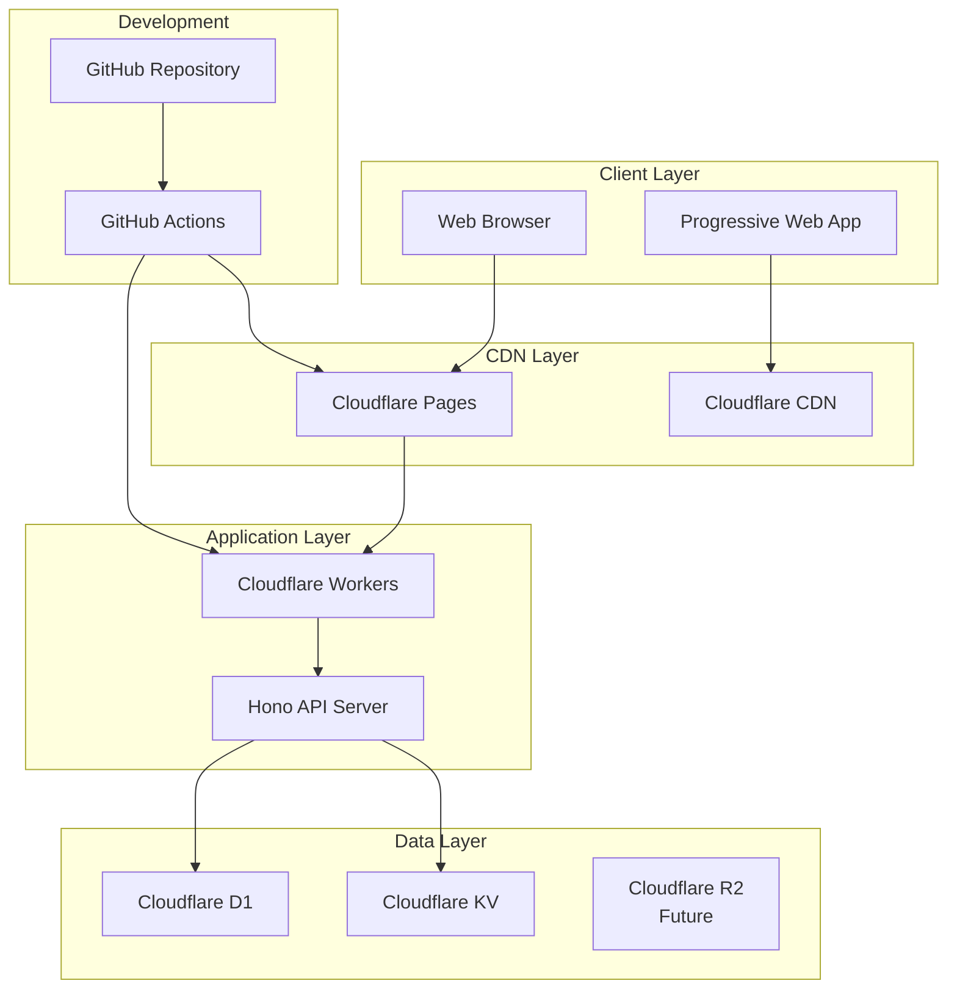
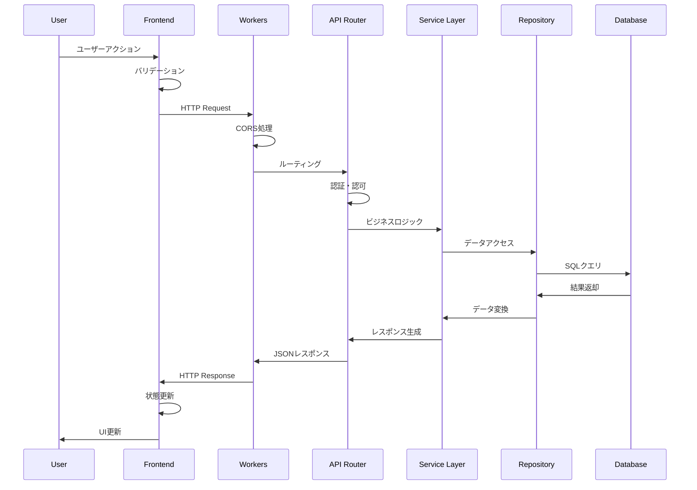
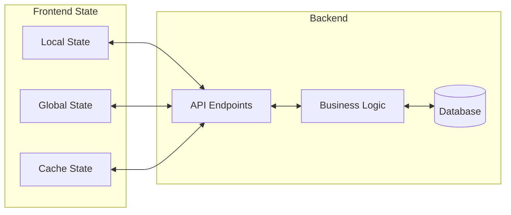
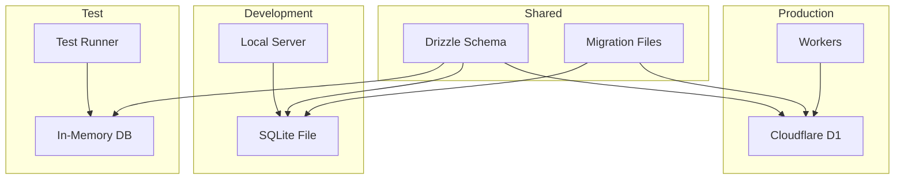
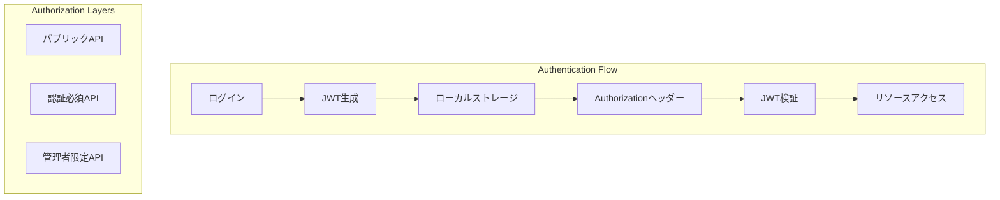
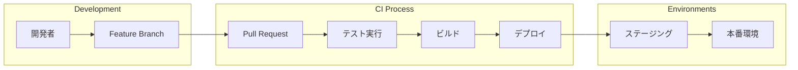
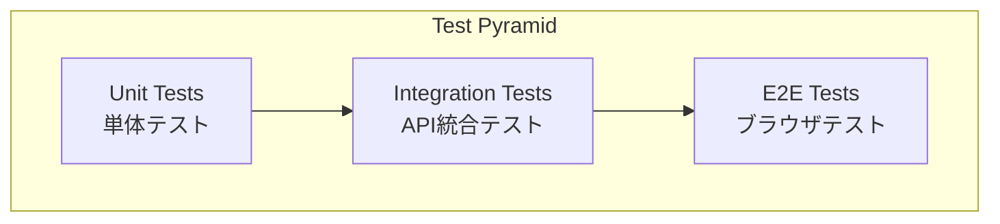
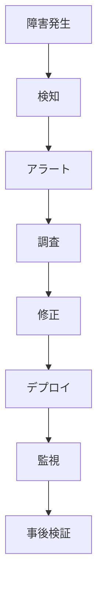

# 🏗️ システム設計書

**作成日**: 2025年7月5日  
**バージョン**: v2.0  
**ステータス**: 承認済み

## 📋 概要

本ドキュメントでは、ポケモンライクゲーム学習プロジェクトのシステム全体のアーキテクチャ設計について詳述します。

## 🎯 設計原則

### 1. 初学者ファースト
- **理解しやすい構造**: 複雑すぎない設計
- **段階的学習**: 機能を段階的に追加可能
- **ドキュメント重視**: 設計意図の明確化

### 2. 型安全性重視
- **TypeScript strict mode**: any型禁止
- **エンドツーエンド型安全**: フロントエンドからバックエンドまで
- **ランタイム検証**: Zodによる入力値検証

### 3. スケーラビリティ
- **モジュラー設計**: 機能単位での分離
- **疎結合**: コンポーネント間の依存関係最小化
- **拡張性**: 新機能追加の容易さ

### 4. 運用性重視
- **環境分離**: 開発・テスト・本番環境の完全分離
- **監視可能性**: ログ・メトリクス収集
- **自動化**: CI/CD・テスト自動化

## 🏛️ 全体アーキテクチャ

### システム構成図



### レイヤー構成

#### 1. Presentation Layer（表示層）
```
Frontend (React + TypeScript)
├── Components/          # 再利用可能なUIコンポーネント
├── Pages/              # ページコンポーネント
├── Hooks/              # カスタムHooks
├── Services/           # API通信
├── Types/              # 型定義
└── Utils/              # ユーティリティ関数
```

#### 2. API Layer（API層）
```
Backend (Hono + TypeScript)
├── Routes/             # APIルート定義
├── Middleware/         # 認証・バリデーション
├── Services/           # ビジネスロジック
├── Repository/         # データアクセス層
├── Types/              # 型定義
└── Utils/              # ユーティリティ関数
```

#### 3. Data Layer（データ層）
```
Database & Storage
├── D1 Database/        # メインデータベース
├── KV Store/           # キャッシュ・セッション
└── R2 Storage/         # ファイルストレージ（将来）
```

## 🔄 データフロー図

### リクエスト処理フロー



### データ同期フロー



## 🧩 コンポーネント設計

### フロントエンド アーキテクチャ

#### コンポーネント階層
```
App
├── Layout/
│   ├── Header
│   ├── Navigation
│   └── Footer
├── Pages/
│   ├── Home
│   ├── Game/
│   │   ├── Map
│   │   ├── Battle
│   │   └── Pokemon
│   └── Settings
└── Shared/
    ├── Button
    ├── Modal
    └── Loading
```

#### 状態管理戦略
```typescript
// Local State: 単一コンポーネント内
const [isLoading, setIsLoading] = useState(false);

// Lifted State: 親コンポーネントで管理
const [gameState, setGameState] = useState<GameState>();

// Global State: アプリケーション全体（将来）
// Zustand or Context API
```

### バックエンド アーキテクチャ

#### 3層アーキテクチャ
```typescript
// 1. Route Layer - HTTPリクエスト処理
app.get('/api/pokemon', pokemonController.getAll);

// 2. Service Layer - ビジネスロジック
class PokemonService {
  async getAllPokemon(): Promise<Pokemon[]> {
    return await this.repository.findAll();
  }
}

// 3. Repository Layer - データアクセス
class PokemonRepository {
  async findAll(): Promise<Pokemon[]> {
    return await this.db.selectFrom('pokemon').selectAll().execute();
  }
}
```

#### 依存性注入パターン
```typescript
// Factory Pattern for Database
export class DatabaseFactory {
  static create(env: Env): DatabaseAdapter {
    switch (env.ENVIRONMENT) {
      case 'production': return new D1Adapter(env.DB);
      case 'development': return new SQLiteAdapter();
      case 'test': return new MockAdapter();
    }
  }
}
```

## 🗄️ データベース設計

### 環境分離戦略



### データアクセス層

#### Adapter Pattern実装
```typescript
export interface DatabaseAdapter {
  prepare(sql: string): PreparedStatement;
  batch(statements: Statement[]): Promise<BatchResult>;
  exec(sql: string): Promise<ExecResult>;
  first<T>(sql: string): Promise<T | null>;
}

class D1Adapter implements DatabaseAdapter {
  constructor(private db: D1Database) {}
  // D1固有の実装
}

class SQLiteAdapter implements DatabaseAdapter {
  constructor(private db: Database) {}
  // SQLite固有の実装
}

class MockAdapter implements DatabaseAdapter {
  private data: Map<string, unknown[]> = new Map();
  // テスト用モック実装
}
```

## 🛡️ セキュリティ設計

### 認証・認可アーキテクチャ（将来実装）



### セキュリティ対策

#### 入力値検証
```typescript
// Zodスキーマによる検証
const PlayerSchema = z.object({
  name: z.string().min(1).max(20),
  level: z.number().int().min(1).max(100)
});

// APIレベルでの検証
app.post('/api/player', async (c) => {
  const body = await c.req.json();
  const validated = PlayerSchema.parse(body); // バリデーション
  // 処理続行
});
```

#### SQLインジェクション対策
```typescript
// ❌ 危険な例
const query = `SELECT * FROM players WHERE id = ${id}`;

// ✅ 安全な例
const stmt = db.prepare('SELECT * FROM players WHERE id = ?');
const result = await stmt.bind(id).first();
```

## 🚀 デプロイメント設計

### CI/CD パイプライン



### 環境構成

#### Development
```yaml
Frontend: localhost:5173 (Vite Dev Server)
Backend: localhost:8787 (Wrangler Dev)
Database: SQLite (./data/local.db)
```

#### Production
```yaml
Frontend: pokemon-game.pages.dev
Backend: pokemon-game-api.workers.dev
Database: Cloudflare D1
```

## 📊 監視・メトリクス設計

### 監視項目

#### パフォーマンスメトリクス
```typescript
// Frontend: Web Vitals
- LCP (Largest Contentful Paint)
- FID (First Input Delay)
- CLS (Cumulative Layout Shift)

// Backend: API Metrics
- Response Time
- Error Rate
- Throughput
```

#### ビジネスメトリクス
```typescript
// ゲーム関連指標
- Daily Active Users
- Session Duration
- Pokemon Catch Rate
- Battle Win Rate
```

### ログ設計

#### 構造化ログ
```typescript
interface LogEntry {
  timestamp: string;
  level: 'info' | 'warn' | 'error';
  message: string;
  context: {
    userId?: string;
    requestId: string;
    action: string;
  };
}
```

## 🔄 API設計

### RESTful API設計原則

#### リソース設計
```
GET    /api/pokemon          # ポケモン一覧取得
POST   /api/pokemon          # ポケモン作成
GET    /api/pokemon/:id      # 特定ポケモン取得
PUT    /api/pokemon/:id      # ポケモン更新
DELETE /api/pokemon/:id      # ポケモン削除

GET    /api/players/:id/pokemon  # プレイヤーのポケモン一覧
POST   /api/players/:id/pokemon  # ポケモン捕獲
```

#### レスポンス形式
```typescript
// 成功レスポンス
interface SuccessResponse<T> {
  success: true;
  data: T;
  meta?: {
    total?: number;
    page?: number;
    limit?: number;
  };
}

// エラーレスポンス
interface ErrorResponse {
  success: false;
  error: {
    code: string;
    message: string;
    details?: unknown;
  };
}
```

## 🧪 テスト戦略

### テストピラミッド



#### テスト分類
```typescript
// Unit Tests (多)
- コンポーネント単体テスト
- 関数・メソッドテスト
- ユーティリティテスト

// Integration Tests (中)
- APIエンドポイントテスト
- データベース連携テスト
- 外部サービス連携テスト

// E2E Tests (少)
- ユーザーシナリオテスト
- ブラウザ自動化テスト
```

## 📈 スケーラビリティ設計

### パフォーマンス最適化

#### フロントエンド最適化
```typescript
// Code Splitting
const MapPage = lazy(() => import('./pages/MapPage'));

// Memoization
const ExpensiveComponent = memo(({ data }) => {
  return useMemo(() => computeExpensiveValue(data), [data]);
});

// Virtual Scrolling
const PokemonList = ({ items }) => {
  // 大量リスト用の仮想スクロール
};
```

#### バックエンド最適化
```typescript
// Database Optimization
- Index設計
- クエリ最適化
- N+1問題対策

// Caching Strategy
- Cloudflare KV for session
- Browser cache for static assets
- API response caching
```

### 拡張性設計

#### モジュラーアーキテクチャ
```
Modules/
├── Pokemon/         # ポケモン関連機能
├── Battle/          # バトル関連機能
├── Player/          # プレイヤー関連機能
├── Items/           # アイテム関連機能
└── Shared/          # 共通機能
```

## 🚨 災害復旧設計

### バックアップ戦略
```yaml
Database:
  - Daily: Automated D1 backup
  - Weekly: Export to R2 storage
  
Code:
  - Repository: GitHub (distributed)
  - Releases: Tagged versions
  
Configuration:
  - Infrastructure as Code
  - Environment variables backup
```

### 障害対応


---

*このシステム設計書は、プロジェクトの技術的な実装指針として機能し、継続的に更新されます。*