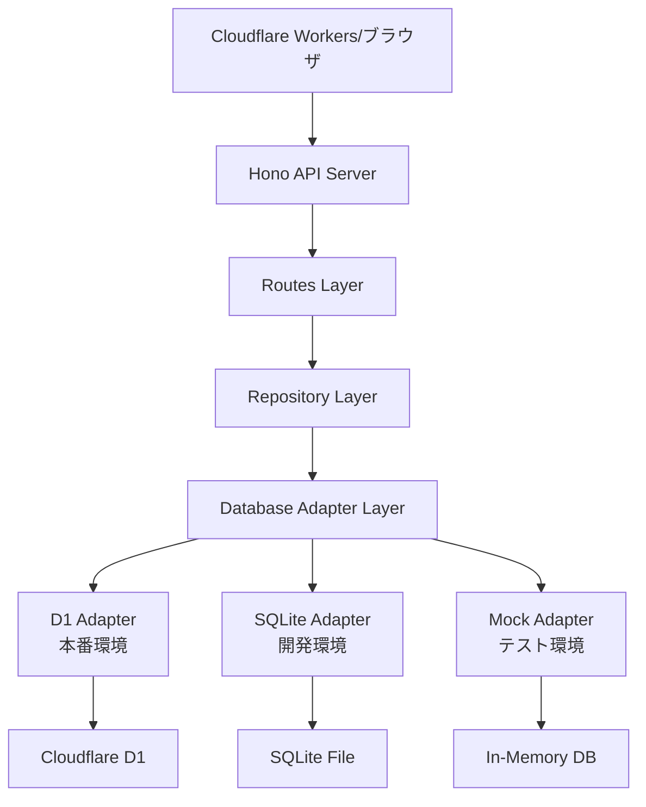
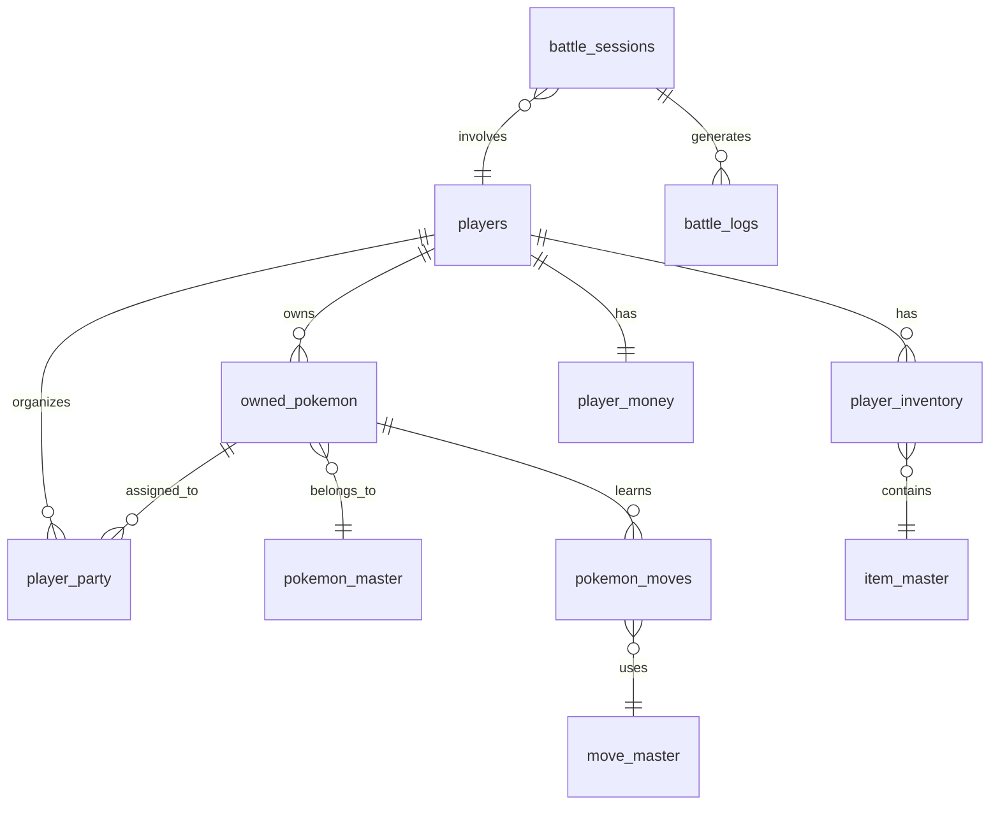

# ポケモンライクゲーム - バックエンド実装状況詳細

## 1. プロジェクト構造

### ディレクトリ構成
```
packages/backend/
├── src/
│   ├── adapters/           # データベースアダプター層
│   ├── database/           # データベース接続・管理
│   ├── db/                 # リポジトリ層・スキーマ定義
│   │   └── schema/         # Drizzle ORMスキーマ
│   ├── routes/             # APIルート定義
│   ├── test-utils/         # テストユーティリティ
│   ├── types/              # 型定義ファイル
│   └── index.ts            # エントリーポイント
├── migrations/             # SQLマイグレーション
├── drizzle/                # Drizzle生成ファイル
└── 設定ファイル群
```

### 主要ファイルと役割

#### エントリーポイント
- **src/index.ts**: Hono APIサーバーのメインファイル
  - CORS設定
  - ルートマウント（/api/pokemon、/api/items、/api/battle）
  - 簡易版プレイヤー・セーブAPIエンドポイント

#### データベース層
- **src/database/factory.ts**: データベースファクトリパターン実装
  - 環境に応じたアダプター選択（D1/SQLite/Mock）
  - 依存性注入パターン

- **src/database/migrator.ts**: マイグレーション管理システム
  - SQLファイルベースのバージョン管理
  - チェックサム検証機能

## 2. アーキテクチャ

### 全体的な設計パターン



### レイヤー構造

#### 1. **Routes Layer（ルート層）**
- HTTPリクエストの受付・レスポンス
- バリデーション
- リポジトリ呼び出し
- エラーハンドリング

#### 2. **Repository Layer（リポジトリ層）**
- ビジネスロジック実装
- データアクセス抽象化
- トランザクション管理

#### 3. **Adapter Layer（アダプター層）**
- データベース固有の実装を隠蔽
- 統一されたインターフェース提供
- 環境別の最適化

### データフロー

```typescript
// 例：ポケモン捕獲のデータフロー
1. POST /api/pokemon/catch/:playerId
   ↓
2. pokemonRoutes.post('/catch/:playerId')
   - リクエストバリデーション
   - 捕獲リクエストオブジェクト生成
   ↓
3. シンプルポケモンリポジトリ.ポケモン捕獲()
   - ビジネスロジック実行
   - データベース操作
   ↓
4. DatabaseAdapter.prepare().bind().run()
   - SQL実行
   - 結果返却
```

## 3. データベース関連

### 現在のデータベース環境分離システム

#### アダプターパターン実装
```typescript
// 統一インターフェース
export interface DatabaseAdapter {
  prepare(sql: string): PreparedStatement;
  batch(statements: Statement[]): Promise<BatchResult>;
  exec(sql: string): Promise<ExecResult>;
  first<T>(sql: string): Promise<T | null>;
  close?(): void;
}
```

#### 環境別アダプター
1. **D1Adapter**: Cloudflare D1用（本番環境）
2. **SQLiteAdapter**: better-sqlite3用（開発環境）
3. **SimplifiedMockAdapter**: メモリ内DB（テスト環境）

### Drizzle ORM導入状況

#### 現在の状態
- **Phase 1**: スキーマ定義完了
- **Phase 2**: 基本設定完了
- **Phase 3**: アダプター実装中（DrizzleDatabaseAdapter）

#### スキーマ構造
```typescript
// プレイヤー関連
- playersTable: プレイヤー基本情報
- playerMoneyTable: 所持金管理
- playerInventoryTable: インベントリ管理

// ポケモン関連
- pokemonMasterTable: 種族マスターデータ
- ownedPokemonTable: 個体管理
- playerPartyTable: パーティ編成

// アイテム関連
- itemMasterTable: アイテムマスターデータ

// バトル関連（従来のSQL定義）
- move_master: 技マスターデータ
- pokemon_moves: 習得技管理
- battle_sessions: バトルセッション
- battle_logs: バトルログ
```

### テーブル構造とスキーマ

#### ER図（主要テーブル）


## 4. API実装

### 実装済みエンドポイント

#### ポケモン管理API（/api/pokemon）
```typescript
GET    /species              # 全種族データ取得
GET    /species/:speciesId   # 特定種族データ取得
GET    /owned/:playerId      # 所有ポケモン一覧（フィルタリング対応）
GET    /owned/detail/:pokemonId # ポケモン詳細取得
POST   /catch/:playerId      # ポケモン捕獲
PUT    /owned/:pokemonId     # ポケモン情報更新
GET    /party/:playerId      # パーティ取得
PUT    /party/:playerId      # パーティ編成
```

#### アイテム管理API（/api/items）
```typescript
GET    /master              # 全アイテムマスター取得
GET    /master/:itemId      # 特定アイテム取得
GET    /category/:category  # カテゴリ別アイテム取得
GET    /inventory/:playerId # プレイヤーインベントリ取得
```

#### バトルシステムAPI（/api/battle）
```typescript
POST   /start               # バトル開始
POST   /:battleId/use-move  # 技使用
GET    /:battleId/status    # バトル状態取得
POST   /:battleId/end       # バトル終了
GET    /moves               # 全技データ取得
```

#### その他のAPI
```typescript
GET    /                    # APIルート情報
GET    /health              # ヘルスチェック
GET    /maps/:mapId         # マップデータ取得（モック）
GET    /player/:playerId    # プレイヤー情報取得（簡易版）
POST   /player              # プレイヤー作成（簡易版）
PUT    /player/:playerId    # プレイヤー更新（簡易版）
```

### リクエスト/レスポンス形式

#### 成功レスポンス
```json
{
  "success": true,
  "data": { /* データ本体 */ },
  "count": 10,  // 配列の場合
  "message": "操作が成功しました"
}
```

#### エラーレスポンス
```json
{
  "success": false,
  "error": "エラーメッセージ"
}
```

## 5. テスト実装

### テスト構成
```
テストファイル数: 8
総テスト数: 72
成功: 69
失敗: 3（itemRepository.test.ts）
```

### テスト戦略

#### 1. **単体テスト**
- リポジトリ層の個別テスト
- ビジネスロジックの検証
- データベース操作の確認

#### 2. **統合テスト**
- APIエンドポイントのE2Eテスト
- HTTPステータスコード検証
- レスポンス形式の確認

#### 3. **テスト環境**
- SimplifiedMockAdapterによる高速実行
- 独立したテストデータベース
- beforeEachでのデータクリーンアップ

### 現在の課題
- ItemRepositoryテストの3件が失敗中
- MockAdapterとItemRepository間の不整合
- 既存29テストの新システムへの移行作業

## 6. 型定義とTypeScript

### 型定義ファイル構成

#### database.ts
```typescript
// データベースアダプター共通インターフェース
export interface DatabaseAdapter { ... }
export interface PreparedStatement { ... }
export interface RunResult { ... }
```

#### drizzleDatabase.ts
```typescript
// Drizzle ORM専用型定義
export interface DrizzleDatabaseAdapter { ... }
export interface DrizzleEnv { ... }
```

#### env.ts
```typescript
// 環境変数型定義
export interface Env {
  DB: D1Database;
  ENVIRONMENT: string;
}
```

### 型安全性の実装状況

#### 強み
- 完全なTypeScript対応（anyの使用禁止）
- Drizzleによる型推論
- Zodによるランタイム検証（一部実装）

#### 改善点
- API入力値の型検証強化
- エラー型の統一化
- レスポンス型の標準化

## 7. ビルドとデプロイ

### ビルド設定

#### package.json scripts
```json
{
  "dev": "wrangler dev --port 8787",
  "build": "tsc",
  "deploy": "wrangler deploy",
  "test": "vitest",
  "db:generate": "drizzle-kit generate",
  "db:migrate": "drizzle-kit migrate"
}
```

#### wrangler.toml
```toml
name = "pokemon-game-api"
compatibility_date = "2025-01-01"

[[d1_databases]]
binding = "DB"
database_name = "pokemon-game-db"
database_id = "189590d0-ecbb-43c9-81d7-911f41f5e851"
```

### 依存関係管理

#### 主要依存関係
- **hono**: 軽量Webフレームワーク
- **drizzle-orm**: 型安全ORM
- **zod**: スキーマバリデーション
- **better-sqlite3**: SQLite実装（開発用）

#### 開発依存関係
- **vitest**: テストフレームワーク
- **wrangler**: Cloudflareデプロイツール
- **typescript**: 型システム
- **eslint**: コード品質管理

## 8. 課題と改善点

### 現在の技術的課題

#### 1. **テスト失敗問題**
- ItemRepositoryの3テストが失敗
- MockAdapterの実装不完全
- 解決策：アダプター実装の見直し

#### 2. **Drizzle移行**
- 一部のリポジトリが未移行
- バトルシステムがSQL直書き
- 解決策：段階的移行計画の実行

#### 3. **型定義の重複**
- database.tsとdrizzleDatabase.tsの役割重複
- 解決策：統合または明確な責任分離

### 今後の改善予定

#### Phase 1: テスト修正（優先度：高）
- ItemRepositoryテストの修正
- 既存29テストの移行
- CI/CD統合

#### Phase 2: Drizzle完全移行（優先度：中）
- バトルシステムのDrizzle化
- リポジトリ層の統一
- 型安全性の向上

#### Phase 3: API改善（優先度：低）
- OpenAPI仕様書作成
- エラーハンドリング統一
- レート制限実装

### パフォーマンスの懸念事項

#### 1. **N+1クエリ問題**
- 現状：ポケモン一覧取得時に個別クエリ
- 対策：Drizzleのリレーション機能活用

#### 2. **大量データ処理**
- 現状：ページネーション未実装の箇所あり
- 対策：統一的なページネーション実装

#### 3. **キャッシュ戦略**
- 現状：キャッシュ未実装
- 対策：Cloudflare KVの活用検討

## まとめ

### 実装完了項目
- ✅ 基本的なAPIエンドポイント
- ✅ データベース環境分離システム
- ✅ ポケモン管理システム
- ✅ アイテム管理システム（一部）
- ✅ バトルシステム（基本機能）
- ✅ テスト環境整備

### 実装中項目
- 🔄 Drizzle ORM完全移行
- 🔄 既存テストの新システム対応
- 🔄 CI/CD統合

### 未実装項目
- ❌ 完全なセーブ/ロードシステム
- ❌ マップ移動システム
- ❌ NPCバトルシステム
- ❌ 進化システム
- ❌ 状態異常システム

本プロジェクトは初学者向けの学習用として設計されており、基本機能の実装を通じてWebアプリケーション開発の基礎を学ぶことができる構成となっています。