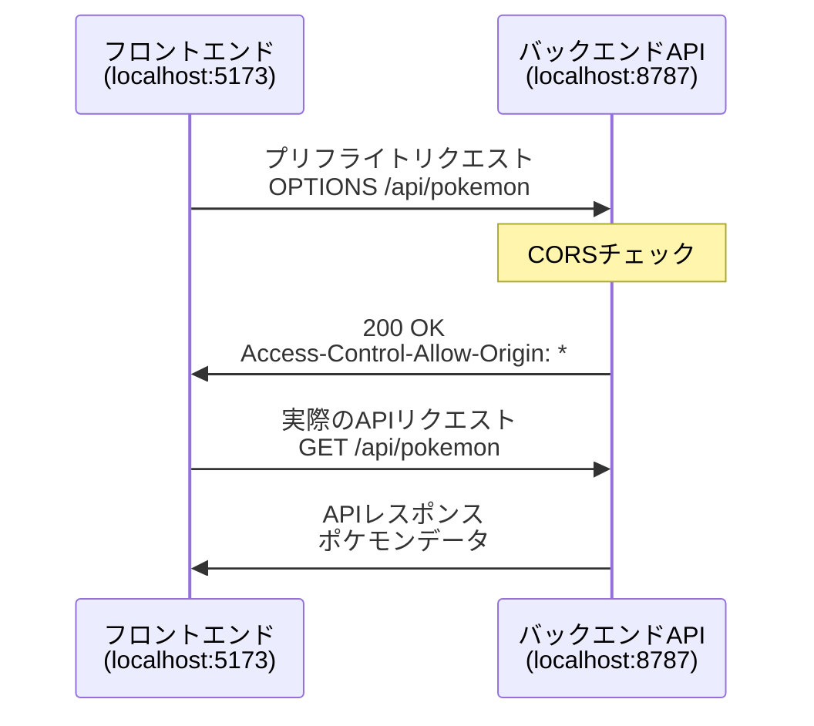
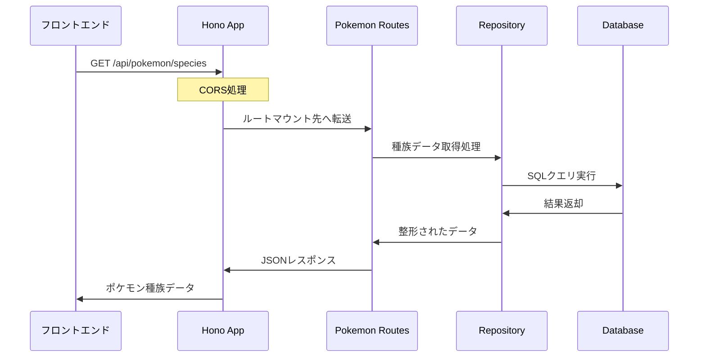
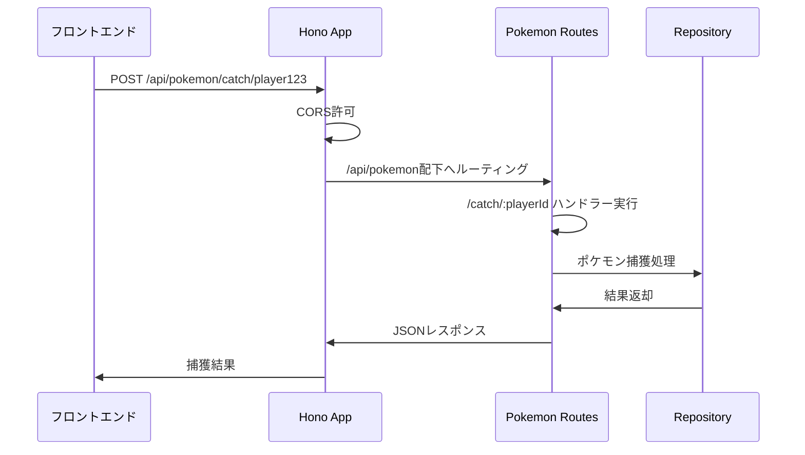

# 📚 index.ts 詳細解説ガイド - Hono初学者向け

**作成日**: 2025年7月4日  
**対象者**: Hono初学者、バックエンド開発初心者  
**前提知識**: TypeScript基礎、Web API基礎

## 🎯 このガイドの目的

このドキュメントでは、ポケモンライクゲームのバックエンドエントリーポイントである `index.ts` について、Hono初学者でも理解できるよう詳細に解説します。

## 📋 目次

1. [Honoフレームワークとは](#honoフレームワークとは)
2. [index.tsの全体構造](#indextsの全体構造)
3. [行ごとの詳細解説](#行ごとの詳細解説)
4. [実際のリクエストフロー](#実際のリクエストフロー)
5. [具体的なユースケース](#具体的なユースケース)
6. [よくある質問](#よくある質問)

## 🚀 Honoフレームワークとは

### Honoの特徴
- **軽量**: 最小限のメモリ使用量
- **高速**: エッジコンピューティングに最適化
- **TypeScript完全対応**: 型安全なAPI開発
- **Cloudflare Workers対応**: サーバーレス環境で動作

### 他のフレームワークとの比較
```typescript
// Express.js（従来のNode.js）
const express = require('express');
const app = express();

// Hono（モダンなエッジ対応）
import { Hono } from 'hono';
const app = new Hono();
```

## 🏗️ index.tsの全体構造

### ファイル構成の概要
```typescript
// 1. インポート部分
import { Hono } from 'hono';
import { cors } from 'hono/cors';
// ...

// 2. アプリケーション初期化
const app = new Hono<{ Bindings: Env }>();

// 3. ミドルウェア設定
app.use('/*', cors());

// 4. ルートマウント
app.route('/api/pokemon', pokemonRoutes);

// 5. 個別エンドポイント定義
app.get('/', (c) => { ... });

// 6. エクスポート
export default app;
```

## 🔍 行ごとの詳細解説

### 1-8行: インポート部分

```typescript
import { Hono } from 'hono';
import { cors } from 'hono/cors';
import { Env } from './types/env';
// import { プレイヤー情報取得, プレイヤー情報保存, プレイヤー情報更新 } from './db/playerRepository';
// import { セーブデータ保存, セーブデータ取得, ユーザーの全セーブデータ取得, セーブデータ削除 } from './db/saveRepository';
import pokemonRoutes from './routes/pokemon';
import { アイテムルート } from './routes/items';
import { battleRoutes } from './routes/battle';
```

#### 詳細説明

**`import { Hono } from 'hono';`**
- Honoの核となるクラスをインポート
- このクラスでWebサーバーアプリケーションを作成

**`import { cors } from 'hono/cors';`**
- CORS（Cross-Origin Resource Sharing）ミドルウェア
- フロントエンド（ブラウザ）からのAPIアクセスを許可するために必要

**`import { Env } from './types/env';`**
- 環境変数の型定義をインポート
- Cloudflare Workers環境での型安全性を確保

**コメントアウトされたインポート**
- 将来実装予定のプレイヤー・セーブデータ機能
- 現在は基本機能に集中するため無効化

**ルートファイルのインポート**
- `pokemonRoutes`: ポケモン関連のAPI群
- `アイテムルート`: アイテム関連のAPI群
- `battleRoutes`: バトル関連のAPI群

### 10-11行: アプリケーション初期化

```typescript
// Hono with Cloudflare Workers（初学者向け：環境変数とデータベースを使えるように設定）
const app = new Hono<{ Bindings: Env }>();
```

#### `new Hono<{ Bindings: Env }>()`の詳細解説

**基本構文**
```typescript
const app = new Hono();  // 基本形
const app = new Hono<{ Bindings: Env }>();  // 型付き版
```

**`Bindings`とは**
- Cloudflare Workers環境で利用可能なリソースの型定義
- データベース、KVストレージ、環境変数等にアクセスするための設定

**`Env`型の中身（types/env.ts）**
```typescript
export interface Env {
  DB: D1Database;        // Cloudflare D1データベース
  ENVIRONMENT: string;   // 環境識別子（dev/test/prod）
}
```

**なぜ型を指定するのか**
```typescript
// 型なし（エラーが発生しやすい）
app.get('/test', (c) => {
  const db = c.env.DB;  // c.envの型が不明
});

// 型あり（型安全）
app.get('/test', (c) => {
  const db = c.env.DB;  // DBがD1Database型だと確実にわかる
});
```

### 13行: CORS設定

```typescript
app.use('/*', cors());
```

#### CORSとは

**CORS（Cross-Origin Resource Sharing）**
- ブラウザのセキュリティ機能
- 異なるドメイン間でのデータ通信を制御
- API呼び出しには必須の設定

#### 具体的なCORSの動作



**CORSなしの場合のエラー**
```
Access to fetch at 'http://localhost:8787/api/pokemon' 
from origin 'http://localhost:5173' has been blocked by CORS policy
```

**CORS設定の効果**
- `'/*'`: すべてのパス（`/api/pokemon`, `/health`等）にCORSを適用
- `cors()`: デフォルト設定（すべてのオリジンを許可）

### 15-22行: ルートマウント

```typescript
// ポケモン関連のAPIルートをマウント（初学者向け：ポケモン機能を追加）
app.route('/api/pokemon', pokemonRoutes);

// アイテム関連のAPIルートをマウント（初学者向け：アイテム・インベントリ機能を追加）
app.route('/api/items', アイテムルート);

// バトル関連のAPIルートをマウント（初学者向け：バトルシステム機能を追加）
app.route('/api/battle', battleRoutes);
```

#### ルートマウントとは

**基本概念**
- 関連するAPI群を機能別にグループ化
- コードの整理とメンテナンス性向上
- チーム開発での責任分担

**マウント前後のURL構造**
```typescript
// マウント前（routes/pokemon.ts内）
pokemon.get('/species', handler);        // パス: /species
pokemon.get('/owned/:playerId', handler); // パス: /owned/:playerId

// マウント後（実際のURL）
// GET http://localhost:8787/api/pokemon/species
// GET http://localhost:8787/api/pokemon/owned/player123
```

#### 各ルートの役割

**ポケモンルート（`/api/pokemon`）**
- 種族データ管理
- 個体ポケモン管理
- パーティ編成

**アイテムルート（`/api/items`）**
- アイテムマスターデータ
- プレイヤーインベントリ

**バトルルート（`/api/battle`）**
- バトル開始・終了
- 技の使用・ダメージ計算

### 24-30行: 基本エンドポイント

```typescript
app.get('/', (c) => {
  return c.json({ message: 'Pokemon-like Game API' });
});

app.get('/api/health', (c) => {
  return c.json({ status: 'ok', timestamp: new Date().toISOString() });
});
```

#### ハンドラー関数の構造

**基本構文**
```typescript
app.get('/path', (c) => {
  // c: Context（コンテキスト）オブジェクト
  // リクエスト情報とレスポンス機能を含む
});
```

**Context（c）オブジェクトの主要メソッド**
```typescript
c.json(data)          // JSONレスポンス
c.text(string)        // テキストレスポンス
c.req.param('id')     // URLパラメータ取得
c.req.json()          // リクエストボディ取得
c.env.DB              // 環境変数アクセス
```

### 32-50行: マップAPI（モック実装）

```typescript
app.get('/api/maps/:mapId', (c) => {
  const mapId = c.req.param('mapId');

  // Simple mock map data
  if (mapId === 'town') {
    return c.json({
      id: 'town',
      name: 'Starting Town',
      width: 15,
      height: 11,
      tiles: Array(11)
        .fill(null)
        .map(() => Array(15).fill({ type: 'grass', walkable: true })),
      exits: [],
    });
  }

  return c.json({ error: 'Map not found' }, 404);
});
```

#### パラメータ処理の詳細

**URL例**: `GET /api/maps/town`
```typescript
const mapId = c.req.param('mapId');  // mapId = 'town'
```

**レスポンス構造**
```json
{
  "id": "town",
  "name": "Starting Town", 
  "width": 15,
  "height": 11,
  "tiles": [
    [{"type": "grass", "walkable": true}, ...], // 15個
    // ...11行
  ],
  "exits": []
}
```

### 56-96行: プレイヤー管理（簡易版）

```typescript
// プレイヤー情報取得（初学者向け：簡易版プレイヤー情報）
app.get('/api/player/:playerId', async (c) => {
  const playerId = c.req.param('playerId');

  // 簡易版: 固定のプレイヤー情報を返す
  const 簡易プレイヤー = {
    id: playerId,
    name: 'プレイヤー',
    position: { x: 7, y: 5 },
    direction: 'down' as const,
    sprite: 'player',
  };

  return c.json(簡易プレイヤー);
});
```

#### 非同期処理（async/await）

**なぜasyncが必要か**
```typescript
// 同期処理（データベースなし）
app.get('/test', (c) => {
  return c.json({ data: 'immediate' });
});

// 非同期処理（データベースあり）
app.get('/test', async (c) => {
  const data = await database.get('player');  // 時間のかかる処理
  return c.json({ data });
});
```

**`as const`の説明**
```typescript
direction: 'down' as const  // 型: 'down'（リテラル型）
direction: 'down'           // 型: string（一般的な文字列型）
```

## 🌊 実際のリクエストフロー

### シーケンス図: ポケモンデータ取得



### リクエスト処理の詳細フロー

1. **リクエスト受信**
   ```
   GET http://localhost:8787/api/pokemon/species
   ```

2. **CORS処理**
   ```typescript
   app.use('/*', cors());  // 全リクエストでCORS許可
   ```

3. **ルートマッチング**
   ```typescript
   app.route('/api/pokemon', pokemonRoutes);  // マッチ成功
   ```

4. **ハンドラー実行**
   ```typescript
   // routes/pokemon.ts内
   pokemon.get('/species', async (c) => {
     // 実際の処理
   });
   ```

## 💡 具体的なユースケース

### ユースケース1: プレイヤー情報取得

**フロントエンドからのリクエスト**
```javascript
// React/TypeScript
const fetchPlayer = async (playerId: string) => {
  const response = await fetch(`http://localhost:8787/api/player/${playerId}`);
  const player = await response.json();
  return player;
};

// 使用例
const player = await fetchPlayer('player123');
console.log(player);
// {
//   id: 'player123',
//   name: 'プレイヤー',
//   position: { x: 7, y: 5 },
//   direction: 'down',
//   sprite: 'player'
// }
```

**バックエンドでの処理**
```typescript
app.get('/api/player/:playerId', async (c) => {
  const playerId = c.req.param('playerId');  // 'player123'
  
  // 簡易版: 固定データを返す
  const 簡易プレイヤー = {
    id: playerId,  // 'player123'
    name: 'プレイヤー',
    position: { x: 7, y: 5 },
    direction: 'down' as const,
    sprite: 'player',
  };

  return c.json(簡易プレイヤー);
});
```

### ユースケース2: ポケモン捕獲

**フロントエンドからのリクエスト**
```javascript
const catchPokemon = async (playerId: string, pokemonData: any) => {
  const response = await fetch(`http://localhost:8787/api/pokemon/catch/${playerId}`, {
    method: 'POST',
    headers: {
      'Content-Type': 'application/json',
    },
    body: JSON.stringify(pokemonData),
  });
  
  return await response.json();
};
```

**リクエストフロー**


### ユースケース3: ヘルスチェック

**モニタリングでの使用**
```bash
# シンプルなヘルスチェック
curl http://localhost:8787/api/health

# レスポンス例
{
  "status": "ok",
  "timestamp": "2025-07-04T10:30:00.000Z"
}
```

**CI/CDパイプラインでの活用**
```yaml
# GitHub Actions例
- name: Health Check
  run: |
    response=$(curl -s http://localhost:8787/api/health)
    if [[ $(echo $response | jq -r '.status') != "ok" ]]; then
      exit 1
    fi
```

## ❓ よくある質問

### Q1: `new Hono<{ Bindings: Env }>()`の`Bindings`が分からない

**A1**: Cloudflare Workers環境で利用可能なリソースの型定義です。

```typescript
// Env型の定義例
export interface Env {
  DB: D1Database;        // データベース接続
  ENVIRONMENT: string;   // 環境名
  API_KEY: string;       // APIキー等
}

// 使用例
app.get('/test', async (c) => {
  const db = c.env.DB;           // 型安全にデータベースアクセス
  const env = c.env.ENVIRONMENT; // 型安全に環境変数アクセス
});
```

### Q2: `cors()`を設定しないとどうなる？

**A2**: ブラウザからのAPIアクセスがブロックされます。

```javascript
// フロントエンド（React）からのFetch
fetch('http://localhost:8787/api/pokemon')
  .then(response => response.json())
  .catch(error => {
    // CORSエラーが発生
    console.error('CORS error:', error);
  });
```

**エラーメッセージ例**
```
Access to fetch at 'http://localhost:8787/api/pokemon' 
from origin 'http://localhost:5173' has been blocked by CORS policy: 
No 'Access-Control-Allow-Origin' header is present on the requested resource.
```

### Q3: ルートマウントをしない場合は？

**A3**: 全てのエンドポイントを1つのファイルに書く必要があります。

```typescript
// マウントなし（非推奨）
app.get('/api/pokemon/species', handler1);
app.get('/api/pokemon/owned/:playerId', handler2);
app.get('/api/items/master', handler3);
app.get('/api/items/inventory/:playerId', handler4);
// ... 100個以上のエンドポイント

// マウントあり（推奨）
app.route('/api/pokemon', pokemonRoutes);  // pokemon関連を分離
app.route('/api/items', itemRoutes);       // items関連を分離
```

### Q4: なぜasync/awaitを使うの？

**A4**: データベースアクセス等の非同期処理のためです。

```typescript
// 同期処理（問題のある例）
app.get('/player/:id', (c) => {
  const data = database.get(id);  // ❌ブロッキング処理
  return c.json(data);
});

// 非同期処理（正しい例）
app.get('/player/:id', async (c) => {
  const data = await database.get(id);  // ✅ノンブロッキング処理
  return c.json(data);
});
```

### Q5: エラーハンドリングはどうする？

**A5**: try-catch文を使用してエラーを適切に処理します。

```typescript
app.post('/api/player', async (c) => {
  try {
    const body = await c.req.json();
    
    // データベース操作等
    const result = await savePlayer(body);
    
    return c.json(result, 201);
  } catch (error) {
    console.error('プレイヤー作成エラー:', error);
    return c.json({ error: 'サーバーエラーが発生しました' }, 500);
  }
});
```

## 🎓 学習のNext Step

### 1. ルートファイルの理解
- `routes/pokemon.ts`
- `routes/items.ts`
- `routes/battle.ts`

### 2. データベース層の理解
- `database/factory.ts`
- `adapters/simplifiedMockAdapter.ts`
- Repository Pattern

### 3. 型定義の理解
- `types/env.ts`
- `types/database.ts`
- TypeScript型システム

### 4. テストの理解
- Vitestでのテスト作成
- モック処理
- APIテスト

---

*このガイドは、Hono初学者がindex.tsを理解し、バックエンド開発の基礎を学ぶためのものです。*