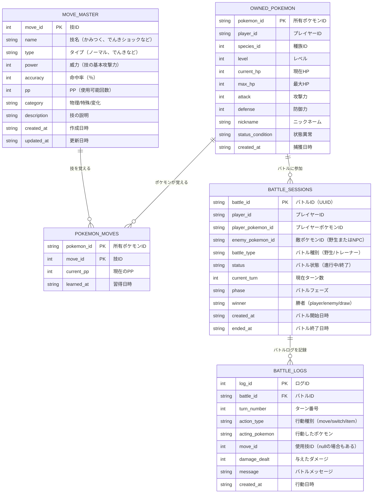
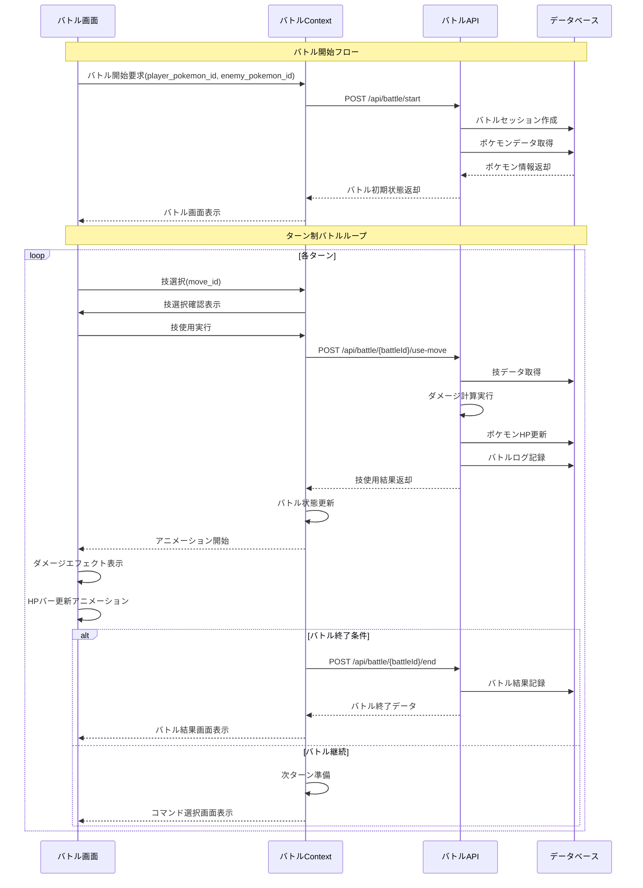
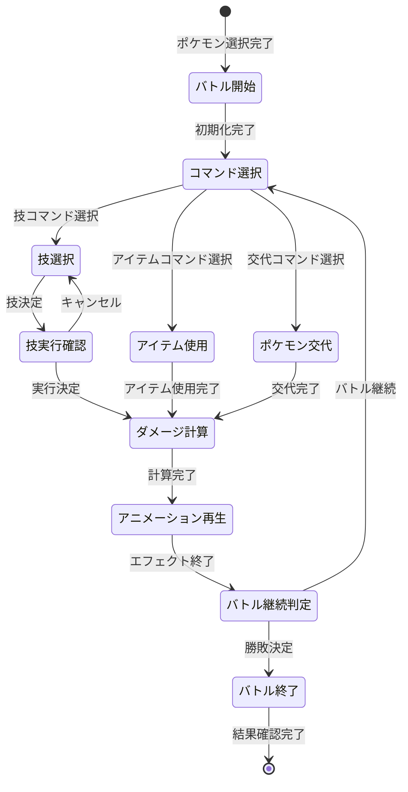

# バトルシステム設計書

## データベース設計

### ER図



## バトルフロー設計

### シーケンス図



## ステートマシン設計

### バトルフェーズ遷移図



## API仕様書

### 1. バトル開始API
```
POST /api/battle/start
Content-Type: application/json

Request:
{
  "player_id": "player-001",
  "player_pokemon_id": "owned-pokemon-123",
  "enemy_pokemon_id": "wild-pokemon-456",
  "battle_type": "wild" | "trainer"
}

Response:
{
  "success": true,
  "battle": {
    "battle_id": "battle-uuid-789",
    "player_pokemon": {
      "pokemon_id": "owned-pokemon-123",
      "name": "ピカチュウ",
      "level": 15,
      "current_hp": 45,
      "max_hp": 45,
      "attack": 55,
      "defense": 40,
      "moves": [...]
    },
    "enemy_pokemon": {
      "pokemon_id": "wild-pokemon-456",
      "name": "ポッポ",
      "level": 12,
      "current_hp": 35,
      "max_hp": 35,
      "attack": 45,
      "defense": 40,
      "moves": [...]
    },
    "current_turn": 1,
    "phase": "コマンド選択"
  }
}
```

### 2. 技使用API
```
POST /api/battle/{battleId}/use-move
Content-Type: application/json

Request:
{
  "pokemon_id": "owned-pokemon-123",
  "move_id": 1,
  "target": "enemy"
}

Response:
{
  "success": true,
  "result": {
    "move_name": "でんきショック",
    "damage_dealt": 18,
    "critical_hit": false,
    "effectiveness": "normal",
    "attacker_hp": 45,
    "target_hp": 17,
    "battle_status": "ongoing" | "ended",
    "winner": null | "player" | "enemy",
    "message": "ピカチュウの でんきショック！ポッポに 18のダメージ！"
  }
}
```

### 3. バトル状態取得API
```
GET /api/battle/{battleId}/status

Response:
{
  "success": true,
  "battle": {
    "battle_id": "battle-uuid-789",
    "status": "ongoing",
    "current_turn": 3,
    "phase": "コマンド選択",
    "player_pokemon": {...},
    "enemy_pokemon": {...},
    "recent_logs": [...]
  }
}
```

## ダメージ計算式（初学者版）

### 基本ダメージ計算
```typescript
// 初学者向けシンプル版ダメージ計算
function ダメージ計算(
  攻撃者: 参戦ポケモン,
  防御者: 参戦ポケモン,
  使用技: 技データ
): number {
  // 基本ダメージ = (攻撃力 × 技威力) ÷ 防御力
  const 基本ダメージ = Math.floor(
    (攻撃者.attack * 使用技.power) / 防御者.defense
  );
  
  // ランダム補正（85%〜100%）
  const ランダム補正 = 0.85 + Math.random() * 0.15;
  
  // 最終ダメージ（最低1ダメージ保証）
  const 最終ダメージ = Math.max(1, Math.floor(基本ダメージ * ランダム補正));
  
  return 最終ダメージ;
}
```

### クリティカル判定（発展版）
```typescript
function クリティカル判定(): boolean {
  // 1/16の確率でクリティカル
  return Math.random() < 0.0625;
}
```

## フロントエンド状態管理

### バトルContext設計
```typescript
interface バトルコンテキスト {
  // 状態
  現在バトル: バトル状態 | null;
  読み込み中: boolean;
  エラーメッセージ: string;
  
  // アクション
  バトル開始: (playerPokemonId: string, enemyPokemonId: string) => Promise<void>;
  技使用: (moveId: number) => Promise<void>;
  バトル終了: () => void;
  
  // UI状態
  選択中技: 技データ | null;
  アニメーション中: boolean;
  メッセージ表示中: boolean;
}
```

## 初学者向け学習ポイント

### 1. ステートマシンパターン
- バトルの複雑な状態遷移を整理
- 各フェーズでの有効な操作を制限

### 2. 非同期処理とアニメーション
- API通信とUI更新の協調
- Promise/async-awaitの実践

### 3. TypeScript型安全性
- 複雑なデータ構造の型定義
- Union型による状態表現

### 4. React Context API
- 複数コンポーネント間での状態共有
- カスタムHooksの活用

---

*この設計書は実装進行に応じて随時更新されます*