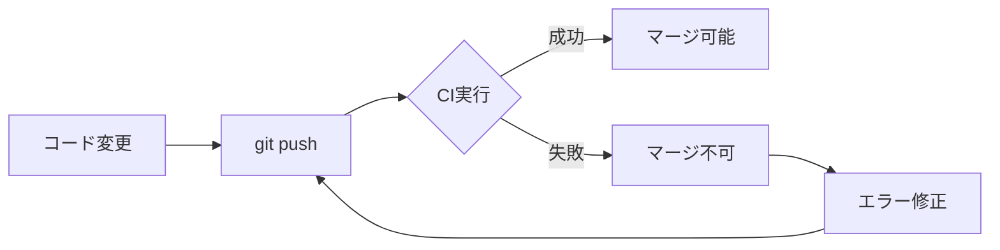

# ブランチ保護設定ガイド（初学者向け）

## 目次

1. [なぜブランチ保護が必要か](#なぜブランチ保護が必要か)
2. [ブランチ保護の仕組み](#ブランチ保護の仕組み)
3. [設定手順](#設定手順)
4. [1人開発での運用方法](#1人開発での運用方法)
5. [段階的な保護強化](#段階的な保護強化)
6. [トラブルシューティング](#トラブルシューティング)

## なぜブランチ保護が必要か

### 🚨 保護なしで起こる問題

#### 1. **本番環境へのバグ混入**

```bash
# ❌ 危険な例：テストを実行せずに直接プッシュ
git add .
git commit -m "新機能追加"
git push origin main  # バグが含まれていても気づかない！
```

**結果**:

- TypeScriptの型エラーがあってもデプロイされる
- 実行時エラーで本番環境がクラッシュ
- ユーザーに影響が出る

#### 2. **コード品質の低下**

```typescript
// ❌ ESLintエラーを無視した悪いコード
function processData(data: any) {
  // any型の使用
  const self = this; // this-aliasエラー
  console.log(data); // セミコロン忘れ
}
```

**結果**:

- コードの一貫性が失われる
- メンテナンスが困難になる
- バグの温床になる

#### 3. **履歴の破壊**

```bash
# ❌ 危険：強制プッシュで履歴を書き換え
git push --force origin main
```

**結果**:

- 他の開発者の作業が失われる
- 復旧が困難になる

### ✅ ブランチ保護のメリット

1. **自動品質チェック**

   - コードをプッシュする前にCIが自動実行
   - エラーがあればマージを防ぐ

2. **安全なデプロイ**

   - テストが通ったコードのみ本番環境へ
   - ユーザーへの影響を最小化

3. **開発者の成長**
   - エラーから学ぶ機会
   - 良いコーディング習慣が身につく

## ブランチ保護の仕組み

### 基本的な流れ



### 保護ルールの種類

| ルール                     | 説明                           | 効果                         |
| -------------------------- | ------------------------------ | ---------------------------- |
| **必須ステータスチェック** | CIが成功する必要がある         | バグのあるコードを防ぐ       |
| **最新化必須**             | マージ前に最新のmainを取り込む | コンフリクトを防ぐ           |
| **管理者も従う**           | 管理者も例外なし               | 全員が同じルールに従う       |
| **会話解決必須**           | すべてのコメントを解決         | レビュー指摘の対応漏れを防ぐ |

## 設定手順

### 方法1: GitHub Web UIでの設定（推奨）

#### Step 1: 設定ページにアクセス

```
https://github.com/[ユーザー名]/[リポジトリ名]/settings/branch_protection_rules/new
```

例：

```
https://github.com/okayus/pokemon-like-game-tutorial/settings/branch_protection_rules/new
```

#### Step 2: 基本設定

1. **Branch name pattern**に `main` を入力

2. **以下の項目にチェック**：

   - ✅ Require status checks to pass before merging
     - ✅ Require branches to be up to date before merging
     - Status checksで「🔍 コード品質チェック」を検索して追加
   - ✅ Require conversation resolution before merging
   - ✅ Do not allow bypassing the above settings

3. **Create**ボタンをクリック

### 方法2: GitHub CLIでの設定

#### 必須ステータスチェックの追加

```bash
# 品質チェックを必須に設定
gh api repos/[ユーザー名]/[リポジトリ名]/branches/main/protection/required_status_checks/contexts \
  -X POST \
  -f contexts[]="🔍 コード品質チェック"
```

#### 現在の設定確認

```bash
# 保護設定の確認
gh api repos/[ユーザー名]/[リポジトリ名]/branches/main/protection --jq '{
  "必須ステータスチェック": .required_status_checks.contexts,
  "最新化必須": .required_status_checks.strict,
  "管理者も従う": .enforce_admins.enabled,
  "会話解決必須": .required_conversation_resolution.enabled
}'
```

## 1人開発での運用方法

### 課題：プルリクエストレビューの承認者

1人開発では承認者を0人に設定できないため、以下の方法を推奨：

### 推奨ワークフロー

#### 1. ブランチを使った開発

```bash
# 機能ブランチを作成
git checkout -b feature/新機能

# 開発作業
# ... コード変更 ...

# コミット
git add .
git commit -m "feat: 新機能を追加"

# プッシュ
git push origin feature/新機能
```

#### 2. プルリクエスト作成

```bash
# CLIで作成
gh pr create \
  --title "新機能の追加" \
  --body "## 変更内容\n- 〇〇機能を実装\n\n## テスト\n- [x] TypeScript型チェック通過\n- [x] ESLintエラーなし"
```

#### 3. CIの確認

```bash
# PR状況を確認
gh pr status

# CIの状態を確認
gh pr checks
```

#### 4. 自己マージ（CIが成功したら）

```bash
# 自動マージを設定（CIが成功したら自動的にマージ）
gh pr merge --auto --merge

# または手動でマージ
gh pr merge --merge
```

### mainブランチへの直接プッシュ

保護が有効でも、CIが通れば直接プッシュ可能：

```bash
# ローカルでテスト実行
pnpm type-check
pnpm lint
pnpm test

# 問題なければプッシュ
git push origin main
# CIが失敗すればプッシュは拒否される
```

## 段階的な保護強化

### Phase 1: 最小限の保護（現在）

```yaml
必須チェック:
  - 🔍 コード品質チェック（TypeScript型チェックのみ）
```

**目的**: 基本的な型安全性を保証

### Phase 2: ESLint追加（ESLintエラー修正後）

```bash
# ESLintエラーを修正したら、CIワークフローを更新
# ci.yml から `|| true` を削除
```

**目的**: コードスタイルの統一

### Phase 3: テスト追加（テスト修正後）

```bash
# 追加の必須チェック
gh api repos/[ユーザー名]/[リポジトリ名]/branches/main/protection/required_status_checks/contexts \
  -X POST \
  -f contexts[]="🚀 バックエンドテスト" \
  -f contexts[]="🎨 フロントエンドテスト"
```

**目的**: 機能の動作保証

### Phase 4: 完全な保護（最終目標）

```yaml
必須チェック:
  - 🔍 コード品質チェック
  - 🚀 バックエンドテスト
  - 🎨 フロントエンドテスト
  - 🌐 E2Eテスト
```

**目的**: 本番環境品質の保証

## トラブルシューティング

### Q: プッシュが拒否される

```bash
! [remote rejected] main -> main (protected branch hook declined)
```

**原因**: CIが失敗している

**解決方法**:

1. CIログを確認

   ```bash
   gh run list --limit 1
   gh run view [run-id] --log-failed
   ```

2. ローカルでエラーを修正

   ```bash
   pnpm type-check
   pnpm lint
   ```

3. 修正後に再プッシュ

### Q: マージボタンが押せない

**原因**: 必須チェックが失敗またはペンディング

**解決方法**:

1. PRページでチェック状態を確認
2. 失敗しているチェックの詳細を見る
3. エラーを修正してプッシュ

### Q: 「Branch is out-of-date」エラー

**原因**: mainブランチが更新されている

**解決方法**:

```bash
# mainの最新を取得
git checkout main
git pull origin main

# ブランチに戻ってリベース
git checkout feature/新機能
git rebase main

# 強制プッシュ（PRの場合のみ）
git push --force-with-lease origin feature/新機能
```

## まとめ

ブランチ保護は以下を実現します：

1. **品質保証**: バグのあるコードの混入を防ぐ
2. **自動化**: 手動チェックの手間を削減
3. **学習機会**: エラーから学んで成長
4. **安心感**: 本番環境への影響を最小化

初学者にとっては最初は面倒に感じるかもしれませんが、良いコーディング習慣を身につける絶好の機会です。エラーは成長のチャンス！

## CI改善：個別ステータスチェックの表示（2025年7月更新）

### 問題点

以前はMain PipelineがCI Pipelineを`workflow_call`で呼び出していたため、個別のジョブがステータスチェックとして表示されませんでした。

### 解決策

CI Pipelineのジョブを直接main.ymlに統合することで、各ジョブが個別のステータスチェックとして表示されるようになりました。

### 新しい構造

```yaml
jobs:
  quality-check: # 🔍 コード品質チェック として表示
  backend-tests: # 🚀 バックエンドテスト として表示
  frontend-tests: # 🎨 フロントエンドテスト として表示
  e2e-tests: # 🌐 E2Eテスト として表示
  deploy: # 🚀 プロダクションデプロイ として表示
  pipeline-summary: # 📊 パイプライン結果 として表示
```

### 確認方法

```bash
# PRのステータスチェック一覧を確認
gh pr checks [PR番号]

# 出力例：
# 🔍 コード品質チェック    pass    34s
# 🚀 バックエンドテスト    skipping
# 🎨 フロントエンドテスト  skipping
# 🌐 E2Eテスト           skipping
```

### メリット

1. **個別の可視性**: 各チェックの成功/失敗が一目で分かる
2. **段階的な必須化**: 特定のチェックのみを必須に設定可能
3. **詳細な制御**: ブランチ保護で細かい設定が可能

### 現在の必須チェック

```bash
# 現在は品質チェックのみ必須
gh api repos/[ユーザー名]/[リポジトリ名]/branches/main/protection/required_status_checks/contexts
# 結果: ["🔍 コード品質チェック"]
```

### 将来の拡張

ESLintエラー修正後、以下を追加：

```bash
# バックエンドテストを必須に追加
gh api repos/[ユーザー名]/[リポジトリ名]/branches/main/protection/required_status_checks/contexts \
  -X POST \
  -f contexts[]="🚀 バックエンドテスト"

# フロントエンドテストを必須に追加
gh api repos/[ユーザー名]/[リポジトリ名]/branches/main/protection/required_status_checks/contexts \
  -X POST \
  -f contexts[]="🎨 フロントエンドテスト"
```

## 参考リンク

- [GitHub Docs: ブランチ保護ルール](https://docs.github.com/ja/repositories/configuring-branches-and-merges-in-your-repository/defining-the-mergeability-of-pull-requests/about-protected-branches)
- [GitHub CLI リファレンス](https://cli.github.com/manual/)
- [CI/CD初学者ガイド](./cicd-beginner-guide.md)
