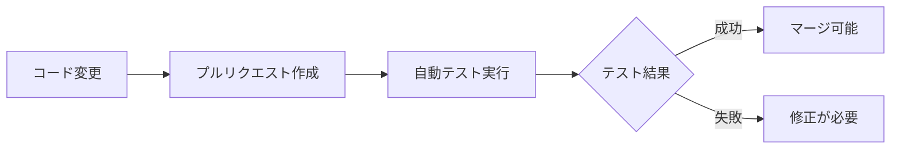
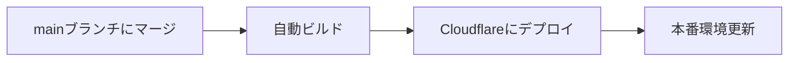
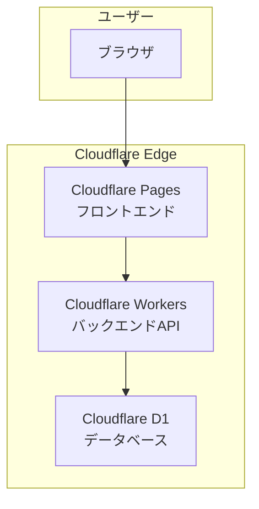
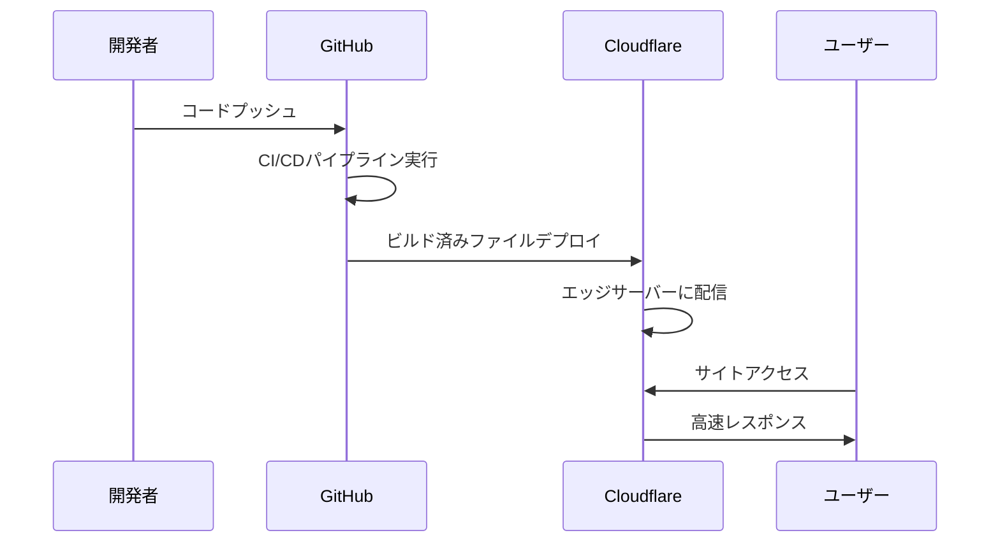

# 初学者向け CI/CD 完全ガイド

## 🎯 このガイドについて

このガイドでは、ポケモンライクゲームプロジェクトで使用しているCI/CD（継続的インテグレーション・継続的デプロイメント）について、初学者にもわかりやすく解説します。

## 📚 目次

1. [CI/CDとは何か？](#cicdとは何か)
2. [なぜCI/CDが重要なのか？](#なぜcicdが重要なのか)
3. [GitHub Actionsの仕組み](#github-actionsの仕組み)
4. [プロジェクトのCI設定](#プロジェクトのci設定)
5. [プロジェクトのCD設定](#プロジェクトのcd設定)
6. [Cloudflareデプロイの理解](#cloudflareデプロイの理解)
7. [トラブルシューティング](#トラブルシューティング)

---

## CI/CDとは何か？

### CI（継続的インテグレーション）とは？

**継続的インテグレーション**は、開発者がコードを変更するたびに、**自動的にテストや品質チェックを行う**仕組みです。



**具体的に何をするか？**
- TypeScriptの型チェック
- ESLintによるコード品質チェック
- ユニットテストの実行
- E2Eテストの実行

### CD（継続的デプロイメント）とは？

**継続的デプロイメント**は、テストが成功したコードを**自動的に本番環境に反映する**仕組みです。



**具体的に何をするか？**
- フロントエンドをCloudflare Pagesにデプロイ
- バックエンドをCloudflare Workersにデプロイ
- データベースマイグレーション実行

---

## なぜCI/CDが重要なのか？

### 🚫 CI/CD**なし**の開発（従来の方法）

```
開発者A: コード変更 → 手動テスト → 手動デプロイ
開発者B: コード変更 → テスト忘れ → バグを本番に投入 💥
開発者C: コード変更 → デプロイ手順間違い → サイトダウン 💥
```

**問題点：**
- 手動作業によるミス
- テストの実行忘れ
- デプロイ手順の属人化
- バグの発見が遅い

### ✅ CI/CD**あり**の開発（現代的な方法）

```
開発者A: コード変更 → 自動テスト → 自動デプロイ ✨
開発者B: コード変更 → 自動テスト → バグを事前発見 → 修正 ✨
開発者C: コード変更 → 統一されたデプロイ → 安全リリース ✨
```

**メリット：**
- ✅ バグの早期発見
- ✅ 品質の安定化
- ✅ デプロイの自動化
- ✅ 開発効率の向上

---

## GitHub Actionsの仕組み

GitHub Actionsは、GitHubが提供する**無料のCI/CDサービス**です。

### 基本概念

#### 1. ワークフロー（Workflow）
`.github/workflows/` フォルダ内のYAMLファイルで定義される**自動化プロセス全体**です。

```yaml
# .github/workflows/ci.yml
name: CI Pipeline  # ワークフロー名

on:  # いつ実行するか？
  pull_request:
    branches: [ main ]

jobs:  # 何を実行するか？
  test:
    runs-on: ubuntu-latest
    steps:
      - name: テスト実行
        run: npm test
```

#### 2. ジョブ（Job）
ワークフロー内の**並列実行可能なタスクグループ**です。

```yaml
jobs:
  # ジョブ1: コード品質チェック
  quality-check:
    name: "🔍 コード品質チェック"
    runs-on: ubuntu-latest
  
  # ジョブ2: バックエンドテスト（ジョブ1と並列実行）
  backend-tests:
    name: "🚀 バックエンドテスト"
    runs-on: ubuntu-latest
```

#### 3. ステップ（Step）
ジョブ内の**個別の実行コマンド**です。

```yaml
steps:
  # ステップ1: コードをダウンロード
  - name: "📥 コードチェックアウト"
    uses: actions/checkout@v4
  
  # ステップ2: Node.js環境セットアップ
  - name: "⚙️ Node.js セットアップ"
    uses: actions/setup-node@v4
    with:
      node-version: "20"
  
  # ステップ3: テスト実行
  - name: "🧪 テスト実行"
    run: npm test
```

### トリガー（実行タイミング）

#### プルリクエスト時のトリガー
```yaml
on:
  pull_request:
    branches: [ main ]  # mainブランチへのPR時
```

#### ブランチプッシュ時のトリガー
```yaml
on:
  push:
    branches: [ main ]  # mainブランチへのプッシュ時
```

#### 手動実行のトリガー
```yaml
on:
  workflow_dispatch:  # GitHub UIから手動実行可能
```

---

## プロジェクトのCI設定

このプロジェクトのCI設定（`.github/workflows/ci.yml`）を詳しく見てみましょう。

### 🔍 コード品質チェックジョブ

```yaml
quality-check:
  name: "🔍 コード品質チェック"
  runs-on: ubuntu-latest
  
  steps:
    # TypeScriptの型エラーチェック
    - name: "🔧 TypeScript 型チェック"
      run: pnpm type-check
    
    # ESLintによるコードスタイルチェック
    - name: "🧹 ESLint 実行"
      run: pnpm lint
    
    # Prettierによるフォーマットチェック
    - name: "💅 コードフォーマットチェック"
      run: pnpm format
```

**なぜこれが重要？**
- **型エラー防止**: TypeScriptの型チェックでランタイムエラーを事前に発見
- **コード品質向上**: ESLintでベストプラクティスに準拠
- **チーム統一**: Prettierで一貫したコードスタイル

### 🚀 バックエンドテストジョブ

```yaml
backend-tests:
  name: "🚀 バックエンドテスト"
  runs-on: ubuntu-latest
  
  steps:
    - name: "🧪 バックエンド ユニットテスト"
      run: |
        cd packages/backend
        pnpm test:run
      env:
        NODE_ENV: test
```

**テストの種類：**
- **ユニットテスト**: 個別の関数・メソッドのテスト
- **統合テスト**: 複数のコンポーネント間の連携テスト
- **APIテスト**: バックエンドAPIエンドポイントのテスト

### 🎨 フロントエンドテストジョブ

```yaml
frontend-tests:
  name: "🎨 フロントエンドテスト"
  runs-on: ubuntu-latest
  
  steps:
    - name: "🧪 フロントエンド ユニットテスト"
      run: |
        cd packages/frontend
        pnpm test:run
      env:
        NODE_ENV: test
```

**フロントエンドテストの内容：**
- **コンポーネントテスト**: Reactコンポーネントの動作確認
- **フックテスト**: カスタムフックの動作確認
- **ユーティリティテスト**: ヘルパー関数のテスト

### 🌐 E2Eテストジョブ

```yaml
e2e-tests:
  name: "🌐 E2Eテスト"
  runs-on: ubuntu-latest
  
  steps:
    # Playwrightブラウザインストール
    - name: "🎭 Playwright ブラウザインストール"
      run: |
        cd packages/frontend
        npx playwright install chromium
    
    # 実際のブラウザでテスト実行
    - name: "🌐 E2Eテスト実行"
      run: |
        pnpm dev &  # 開発サーバー起動
        sleep 30    # サーバー起動待機
        cd packages/frontend
        pnpm test:e2e
```

**E2Eテストとは？**
- **End-to-End**: ユーザーの実際の操作をブラウザで再現
- **実環境テスト**: 本物のブラウザで動作確認
- **統合確認**: フロントエンド・バックエンド・データベースの連携確認

---

## プロジェクトのCD設定

このプロジェクトのCD設定（`.github/workflows/deploy.yml`）を詳しく見てみましょう。

### 🚀 デプロイ準備ジョブ

```yaml
prepare-deploy:
  name: "🚀 デプロイ準備"
  
  steps:
    - name: "🔍 デプロイ条件チェック"
      run: |
        COMMIT_MESSAGE=$(git log -1 --pretty=%B)
        
        # "skip deploy" があったらデプロイをスキップ
        if echo "$COMMIT_MESSAGE" | grep -E "(skip deploy|no deploy)"; then
          echo "should-deploy=false" >> $GITHUB_OUTPUT
        else
          echo "should-deploy=true" >> $GITHUB_OUTPUT
        fi
```

**デプロイスキップ機能**
コミットメッセージに `skip deploy` と書くと、デプロイを自動的にスキップします。

```bash
git commit -m "docs: READMEを更新 skip deploy"
# このコミットはデプロイされない
```

### 🏗️ ビルドジョブ

```yaml
build:
  name: "🏗️ プロジェクトビルド"
  
  steps:
    - name: "🔨 プロダクションビルド"
      run: pnpm build
      env:
        NODE_ENV: production
```

**プロダクションビルドとは？**
- **最適化**: コードの圧縮・最適化
- **バンドル**: 複数ファイルを統合
- **静的化**: 動的コンテンツの事前生成

### 🎨 フロントエンドデプロイジョブ

```yaml
deploy-frontend:
  name: "🎨 フロントエンド デプロイ"
  
  steps:
    - name: "☁️ Pages デプロイ"
      if: ${{ secrets.CLOUDFLARE_API_TOKEN != '' }}
      uses: cloudflare/pages-action@v1
      with:
        apiToken: ${{ secrets.CLOUDFLARE_API_TOKEN }}
        accountId: ${{ secrets.CLOUDFLARE_ACCOUNT_ID }}
        projectName: pokemon-like-game
        directory: packages/frontend/dist
```

**Cloudflare Pagesとは？**
- **静的サイトホスティング**: HTML/CSS/JSファイルの配信
- **CDN**: 世界中のサーバーから高速配信
- **無料プラン**: 個人プロジェクトに十分な容量

### 🚀 バックエンドデプロイジョブ

```yaml
deploy-backend:
  name: "🚀 バックエンド デプロイ"
  
  steps:
    - name: "☁️ Workers デプロイ"
      if: ${{ secrets.CLOUDFLARE_API_TOKEN != '' }}
      uses: cloudflare/wrangler-action@v3
      with:
        apiToken: ${{ secrets.CLOUDFLARE_API_TOKEN }}
        accountId: ${{ secrets.CLOUDFLARE_ACCOUNT_ID }}
        workingDirectory: packages/backend
```

**Cloudflare Workersとは？**
- **サーバーレス関数**: サーバー管理不要のバックエンド
- **エッジコンピューティング**: ユーザーに近い場所で実行
- **高性能**: 低遅延・高スループット

---

## Cloudflareデプロイの理解

### なぜCloudflareを選ぶのか？

#### 従来のホスティング vs Cloudflare

| 従来のホスティング | Cloudflare |
|-------------------|------------|
| サーバー管理が必要 | サーバーレス |
| 固定費用 | 従量課金（無料枠大） |
| 単一リージョン | 世界中にエッジサーバー |
| スケール手動 | 自動スケール |
| セキュリティ手動 | DDoS保護標準 |

### Cloudflareアーキテクチャ



### デプロイフロー



---

## トラブルシューティング

### よくある問題と解決方法

#### 1. CIテストが失敗する

**症状**: プルリクエスト時にテストが赤になる

**原因と解決策**:

```bash
# TypeScript型エラー
❌ Type 'string' is not assignable to type 'number'
✅ 型定義を修正する

# ESLintエラー  
❌ 'useState' is defined but never used
✅ 不要なimportを削除する

# テスト失敗
❌ Expected 'Hello' but received 'Hi'
✅ テストケースまたは実装を修正する
```

#### 2. デプロイが失敗する

**症状**: mainブランチにマージしてもデプロイされない

**チェックポイント**:

```yaml
# 1. Cloudflare認証情報が設定されているか？
secrets.CLOUDFLARE_API_TOKEN
secrets.CLOUDFLARE_ACCOUNT_ID

# 2. ビルドエラーが発生していないか？
- name: "🔨 プロダクションビルド"
  run: pnpm build  # ここでエラー？

# 3. コミットメッセージにスキップ指示があるか？
git commit -m "fix: バグ修正 skip deploy"  # デプロイされない
```

#### 3. E2Eテストが不安定

**症状**: 時々E2Eテストが失敗する

**解決策**:

```javascript
// 待機時間を追加
await page.waitForTimeout(1000);

// 要素の表示を待つ
await page.waitForSelector('[data-testid="loading-complete"]');

// ネットワーク完了を待つ
await page.waitForLoadState('networkidle');
```

### デバッグ方法

#### 1. GitHub Actions ログの確認

```
1. GitHubリポジトリ → Actions タブ
2. 失敗したワークフローをクリック
3. 失敗したジョブをクリック
4. エラーメッセージを確認
```

#### 2. ローカルでの再現確認

```bash
# CIと同じ環境でテスト実行
NODE_ENV=test pnpm test:run

# 本番ビルドの確認
NODE_ENV=production pnpm build

# E2Eテストのローカル実行
pnpm dev &
pnpm test:e2e
```

#### 3. Cloudflareダッシュボードの確認

```
1. Cloudflareダッシュボードにログイン
2. Workers & Pages → 該当プロジェクト
3. デプロイメント履歴を確認
4. ログ・エラーメッセージを確認
```

---

## 📝 まとめ

### CI/CDで学べること

1. **自動化の重要性**: 手動作業を減らし、ミスを防ぐ
2. **品質保証**: テストを通じてコード品質を維持
3. **DevOps文化**: 開発と運用の連携
4. **クラウドサービス**: 現代的なインフラの活用

### 次のステップ

1. **自分でCI/CDを設定**: 他のプロジェクトでも導入してみる
2. **カスタマイズ**: プロジェクトに応じてワークフローを調整
3. **モニタリング**: デプロイ後の監視・アラート設定
4. **パフォーマンス最適化**: ビルド時間の短縮・並列実行

### 参考リンク

- [GitHub Actions公式ドキュメント](https://docs.github.com/en/actions)
- [Cloudflare Pages ドキュメント](https://developers.cloudflare.com/pages/)
- [Cloudflare Workers ドキュメント](https://developers.cloudflare.com/workers/)

---

**🎉 お疲れ様でした！** CI/CDを理解することで、より効率的で安全な開発ができるようになります。