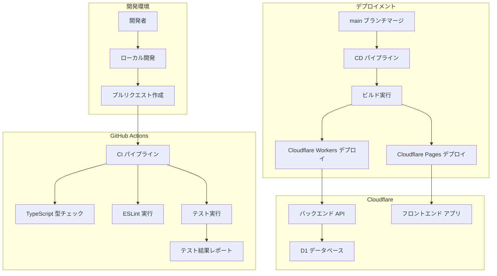
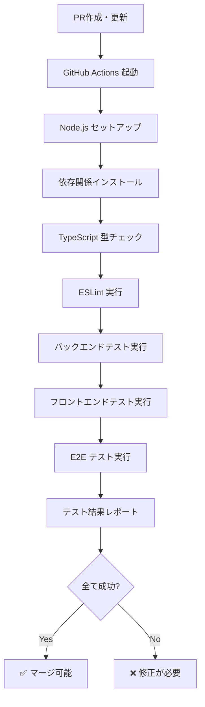
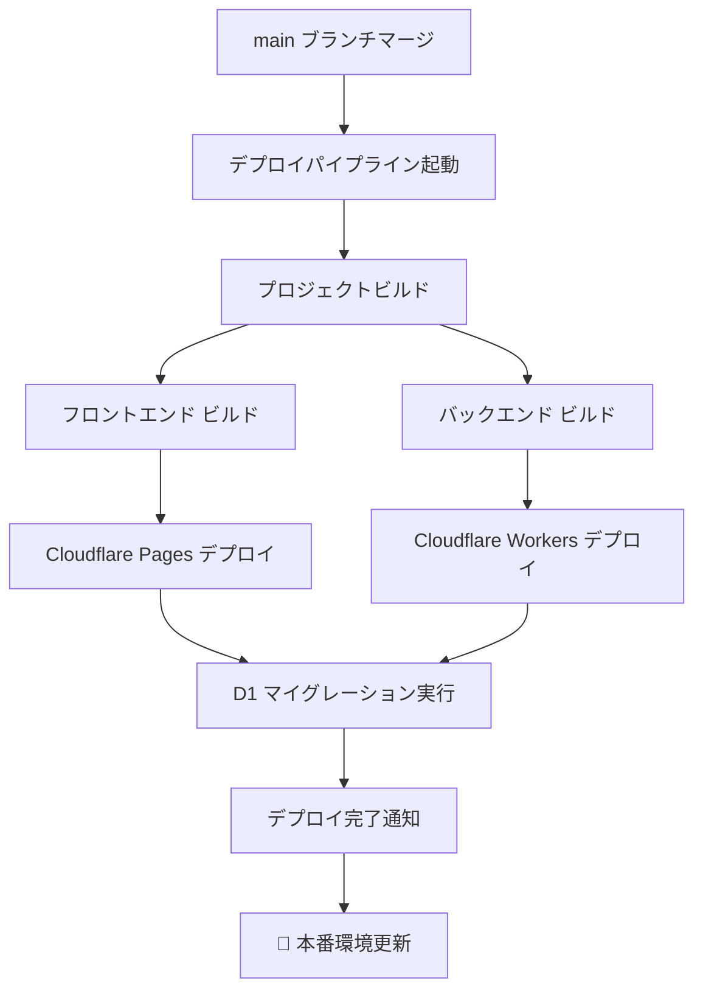

# CI/CDパイプライン実装計画書

## 📋 概要

初学者向けポケモンライクゲームプロジェクトに、GitHub ActionsとCloudflareを使用したCI/CDパイプラインを構築します。

### 🎯 実装目標

- **継続的インテグレーション**: プルリクエスト時の自動テスト実行
- **継続的デプロイメント**: mainブランチへのマージ時の自動デプロイ（テスト成功時のみ）
- **品質保証**: TypeScript型チェック、Lint、テスト実行
- **初学者学習**: CI/CD概念の実践的理解

### ✅ 更新（2025-07-02）

**パイプライン最適化完了:**

- ✅ **メインパイプライン**: プルリクエスト時はテストのみ、mainマージ時はテスト成功後デプロイ
- ✅ **デプロイ制御**: テスト失敗時はデプロイをスキップ
- ✅ **重複回避**: CI/Deployパイプラインは個別実行を無効化し、メインパイプラインから呼び出し

## 🏗️ アーキテクチャ設計

### システム構成図



### パイプライン設計

#### CI パイプライン（プルリクエスト時）



#### CD パイプライン（デプロイメント）



## 📝 実装フェーズ

### Phase 1: 基盤設定 ⭐ 優先度: 高

- [ ] GitHub Issue作成
- [ ] 実装ブランチ作成（`feature/cicd-pipeline`）
- [ ] Cloudflare設定確認・準備
  - [ ] Cloudflare アカウント確認
  - [ ] API トークン設定
  - [ ] Workers・Pages・D1設定確認

### Phase 2: CI パイプライン実装 ⭐ 優先度: 高

- [ ] GitHub Actions ワークフロー作成
  - [ ] `.github/workflows/ci.yml` 作成
  - [ ] Node.js セットアップ
  - [ ] pnpm キャッシュ設定
- [ ] コード品質チェック
  - [ ] TypeScript 型チェック
  - [ ] ESLint 実行
  - [ ] Prettier フォーマットチェック
- [ ] テスト実行設定
  - [ ] バックエンド ユニットテスト
  - [ ] フロントエンド ユニットテスト
  - [ ] 統合テスト実行
  - [ ] E2E テスト実行（Playwright）

### Phase 3: CD パイプライン実装 ⭐ 優先度: 高

- [ ] デプロイワークフロー作成
  - [ ] `.github/workflows/deploy.yml` 作成
  - [ ] main ブランチ専用トリガー設定
- [ ] Cloudflare デプロイ設定
  - [ ] Cloudflare Workers デプロイ
  - [ ] Cloudflare Pages デプロイ
  - [ ] 環境変数・シークレット設定
- [ ] データベース管理
  - [ ] D1 マイグレーション自動実行
  - [ ] データベース接続確認

### Phase 4: 環境設定・セキュリティ ⭐ 優先度: 中

- [ ] 環境変数管理
  - [ ] GitHub Secrets 設定
  - [ ] Cloudflare 環境変数設定
  - [ ] セキュリティキー管理
- [ ] ブランチ保護設定
  - [ ] main ブランチ保護ルール
  - [ ] プルリクエスト必須設定
  - [ ] レビュー要求設定

### Phase 5: 監視・通知・最適化 ⭐ 優先度: 低

- [ ] 通知システム設定
  - [ ] デプロイ成功・失敗通知
  - [ ] Slack/Discord 連携（オプション）
- [ ] パフォーマンス最適化
  - [ ] ビルド時間短縮
  - [ ] キャッシュ最適化
  - [ ] 並列実行設定
- [ ] ログ・モニタリング
  - [ ] デプロイログ保存
  - [ ] エラー追跡設定

### Phase 6: ドキュメント・学習コンテンツ ⭐ 優先度: 低

- [ ] CI/CD ドキュメント作成
  - [ ] 初学者向けCI/CD解説
  - [ ] GitHub Actions 学習ガイド
  - [ ] Cloudflare デプロイガイド
- [ ] トラブルシューティングガイド
  - [ ] よくある問題と解決策
  - [ ] デバッグ方法

## 🛠️ 技術仕様

### GitHub Actions 設定

#### CI ワークフロー (`ci.yml`)

```yaml
name: CI Pipeline

on:
  pull_request:
    branches: [main]
  push:
    branches: [main]

jobs:
  test:
    runs-on: ubuntu-latest

    steps:
      - uses: actions/checkout@v4
      - uses: pnpm/action-setup@v2
        with:
          version: latest
      - uses: actions/setup-node@v4
        with:
          node-version: '20'
          cache: 'pnpm'

      - name: Install dependencies
        run: pnpm install

      - name: Type check
        run: pnpm type-check

      - name: Lint
        run: pnpm lint

      - name: Test
        run: pnpm test

      - name: E2E Test
        run: pnpm test:e2e
```

#### デプロイワークフロー (`deploy.yml`)

```yaml
name: Deploy to Cloudflare

on:
  push:
    branches: [main]

jobs:
  deploy:
    runs-on: ubuntu-latest

    steps:
      - uses: actions/checkout@v4
      - name: Deploy to Cloudflare
        uses: cloudflare/wrangler-action@v3
        with:
          apiToken: ${{ secrets.CLOUDFLARE_API_TOKEN }}
```

### Cloudflare 設定

#### wrangler.toml 設定

```toml
name = "pokemon-like-game"
main = "packages/backend/src/index.ts"
compatibility_date = "2024-01-01"

[env.production]
name = "pokemon-like-game-production"

[[env.production.d1_databases]]
binding = "DB"
database_name = "pokemon-game-db"
database_id = "your-database-id"
```

### 必要な環境変数・シークレット

#### GitHub Secrets

- `CLOUDFLARE_API_TOKEN`: Cloudflare API トークン
- `CLOUDFLARE_ACCOUNT_ID`: Cloudflare アカウント ID
- `DATABASE_ID`: D1 データベース ID

#### Cloudflare 環境変数

- `NODE_ENV`: production
- `API_BASE_URL`: バックエンド API URL

## 🎓 初学者向け学習ポイント

### CI/CD 概念の理解

- **継続的インテグレーション**: コード変更の自動テスト
- **継続的デプロイメント**: 自動的な本番環境への反映
- **品質保証**: 自動化されたコード品質チェック

### GitHub Actions の理解

- **ワークフロー**: 自動化されたプロセス
- **ジョブ**: 並列実行可能なタスクグループ
- **ステップ**: 個別の実行コマンド

### Cloudflare Platform の理解

- **Workers**: サーバーレス関数実行環境
- **Pages**: 静的サイトホスティング
- **D1**: SQLite 互換データベース

## 📊 成功指標

### 技術指標

- [ ] プルリクエスト時の自動テスト実行率: 100%
- [ ] デプロイ成功率: 95%以上
- [ ] ビルド時間: 5分以内
- [ ] テスト実行時間: 3分以内

### 学習指標

- [ ] CI/CD概念の理解度向上
- [ ] GitHub Actions の実践的使用
- [ ] Cloudflare Platform の活用

## 🔄 実装スケジュール

| フェーズ                 | 推定工数 | 優先度 |
| ------------------------ | -------- | ------ |
| Phase 1: 基盤設定        | 0.5日    | 高     |
| Phase 2: CI パイプライン | 1日      | 高     |
| Phase 3: CD パイプライン | 1日      | 高     |
| Phase 4: 環境設定        | 0.5日    | 中     |
| Phase 5: 監視・最適化    | 0.5日    | 低     |
| Phase 6: ドキュメント    | 0.5日    | 低     |

**合計推定工数**: 4日  
**優先実装**: Phase 1-3（2.5日）

## 🚀 次のステップ

1. GitHub Issue 作成
2. 実装ブランチ作成
3. Cloudflare 設定確認
4. Phase 1 から順次実装開始

---

**作成日**: 2025-07-02  
**ステータス**: 計画策定完了 - 実装開始準備中
