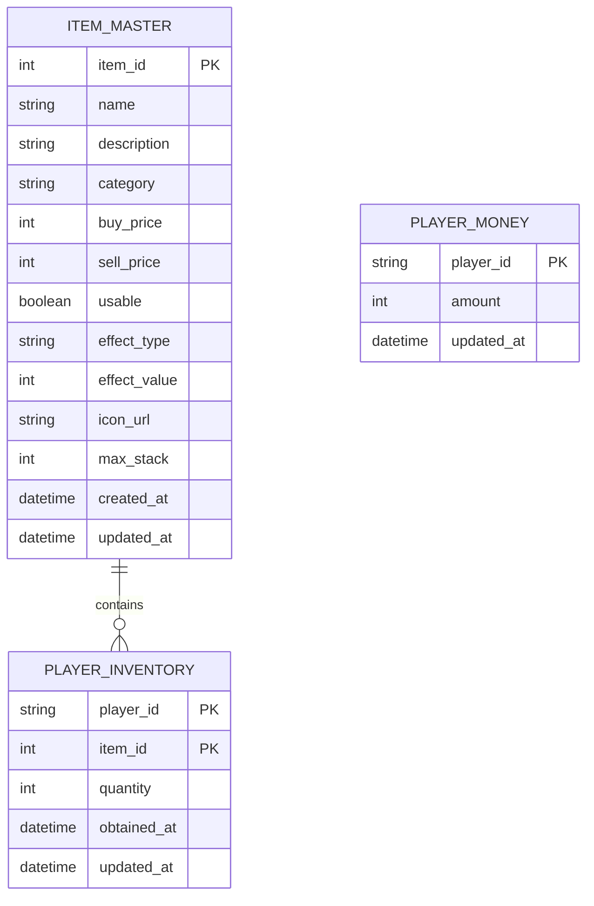

# アイテム・インベントリシステム実装計画書

## 📋 Issue #14 実装計画

**関連Issue**: [#14 アイテム・インベントリシステムの実装](https://github.com/okayus/pokemon-like-game-tutorial/issues/14)

### 🎯 実装概要

アイテムの取得、使用、管理ができるインベントリシステムを実装します。初学者向けのシンプルな設計で、段階的に機能を追加していきます。

### ✅ 完了済み基盤システム

- [x] ポケモン管理システム（パーティ編成、所有ポケモン）
- [x] プレイヤーデータ管理基盤
- [x] 共通UIコンポーネント（LoadingSpinner、ErrorMessage、SuccessNotification）
- [x] TDDテスト環境

### 🔄 実装予定機能（チェックボックス形式）

#### Phase 1: アイテムデータ構造とマスターデータ ✅ 完了
- [x] アイテムの基本データ構造定義
  - [x] アイテムマスターテーブル設計（ER図作成）
  - [x] TypeScriptインターフェース定義
  - [x] アイテムカテゴリ定義（回復、ボール、大切なもの、etc）
- [x] プレイヤーインベントリデータ構造
  - [x] 所持アイテムテーブル設計
  - [x] アイテム個数管理
  - [x] 最大所持数制限
- [x] アイテムマスターデータ作成
  - [x] 基本的な回復アイテム（きずぐすり、いいきずぐすりなど）
  - [x] モンスターボール系（モンスターボール、スーパーボールなど）
  - [x] 大切なものカテゴリ

#### Phase 2: バックエンドAPI実装 ✅ 完了
- [x] D1データベーススキーマ作成
  - [x] アイテムマスターテーブル
  - [x] プレイヤー所持アイテムテーブル
  - [x] 初期マスターデータ投入
- [x] アイテム管理API実装
  - [x] インベントリ一覧取得API
  - [x] アイテム使用API
  - [x] アイテム取得API（報酬・拾得）
- [x] 所持金システムAPI
  - [x] 所持金取得・更新API
  - [x] アイテム購入・売却API
- [x] アイテムリポジトリ実装（TDDアプローチ）

#### Phase 3: フロントエンドインベントリUI ✅ 完了
- [x] インベントリページ作成
  - [x] `/items/inventory/:playerId` ルート追加
  - [x] カテゴリタブUI実装（6カテゴリ：すべて、回復、ボール、戦闘、大切なもの、その他）
  - [x] アイテムグリッド表示（レスポンシブグリッドレイアウト）
  - [x] アイテム詳細表示（カード形式）
- [x] アイテム使用機能
  - [x] 使用可能アイテムの判定（usableフィールドによる制御）
  - [x] 使用確認ダイアログ（window.confirm使用）
  - [x] 使用結果の表示（成功メッセージ・エラーメッセージ）
- [x] 検索・フィルタリング機能
  - [x] アイテム名検索（リアルタイム検索）
  - [x] カテゴリ別フィルター（タブ選択）
  - [x] ソート機能（取得日降順）
  - [x] ページネーション（1ページ20件）

#### Phase 4: ショップシステム ✅ 完了
- [x] ショップページ作成
  - [x] `/items/shop/:playerId` ルート追加
  - [x] 商品一覧表示（購入可能アイテムのみ表示）
  - [x] 購入・売却UI（モード切り替えタブ）
- [x] 商品購入機能
  - [x] 所持金チェック（不足時エラーメッセージ）
  - [x] 購入確認ダイアログ（価格と所持金表示）
  - [x] 在庫管理（無限在庫として実装）
- [x] アイテム売却機能
  - [x] 売却可能アイテム判定（sell_price > 0）
  - [x] 売却価格計算（マスターデータから取得）
  - [x] 売却確認と実行（数量表示付き）
- [x] UI/UX改善
  - [x] 共通ヘッダーへのナビゲーション追加（アイテム・ショップリンク）
  - [x] カテゴリフィルター機能
  - [x] TDDテスト作成（15テストケース）

#### Phase 5: ゲーム内統合 ✅ 完了
- [x] マップでのアイテム取得
  - [x] マップ上のアイテムボックス配置（始まりの町、北の森に配置済み）
  - [x] アイテム取得演出（ボックス開封アニメーション）
  - [x] 取得通知システム（モーダル通知と自動クローズ）
- [x] システム統合
  - [x] アイテムボックス表示コンポーネント（ItemBoxDisplay）
  - [x] アイテム取得通知コンポーネント（ItemObtainNotification）
  - [x] マップページへの統合（Space キーで開封）
  - [x] 型定義の追加（itemBox.ts、itemBoxData.ts）
- [x] ポケモン管理システム連携
  - [x] 回復アイテムでポケモン回復（PokemonSelectDialog実装完了）
  - [ ] モンスターボール在庫確認
  - [ ] アイテム使用履歴

#### Phase 6: 統合とUX改善 ⭐ 優先度: 低
- [ ] 共通ヘッダーにアイテムアイコン追加
- [ ] 通知システム統合
  - [ ] アイテム取得通知
  - [ ] インベントリ満杯警告
  - [ ] 所持金不足エラー
- [ ] アニメーション・エフェクト
  - [ ] アイテム使用時のエフェクト
  - [ ] 購入・売却時のアニメーション

### 🎨 UI/UXデザイン方針

#### デザインシステム
- **TailwindCSS v4**: 既存のデザインシステムと統一
- **タブナビゲーション**: カテゴリ別の直感的な操作
- **グリッドレイアウト**: アイテムアイコンを見やすく配置
- **モーダルダイアログ**: 詳細表示と操作確認

#### 初学者向けUI設計
- **アイコンベース**: 文字だけでなく視覚的に分かりやすく
- **カテゴリ分け**: 明確な分類で迷わない設計
- **数量表示**: 残り個数を常に表示
- **操作フィードバック**: 成功・失敗を明確に伝える

### ⚙️ 技術仕様

#### バックエンド（Hono + Cloudflare D1）
- **RESTful API**: 標準的なHTTPメソッドで統一
- **トランザクション**: アイテム使用・購入時の整合性保証
- **バリデーション**: 入力値の厳密なチェック
- **エラーハンドリング**: 分かりやすいエラーレスポンス

#### フロントエンド（React + TypeScript）
- **状態管理**: useStateとuseContextで管理
- **API連携**: 既存のAPIサービスパターンを踏襲
- **型安全性**: TypeScriptの厳密な型定義
- **再利用性**: 共通コンポーネントの活用

#### データベース設計
- **正規化**: 適切な関係設計でデータ整合性確保
- **インデックス**: パフォーマンス最適化
- **制約**: データの一貫性を保つ制約設定

### 🧪 テスト戦略

#### ユニットテスト
- [ ] アイテムデータ変換ユーティリティ
- [ ] インベントリコンポーネント
- [ ] ショップコンポーネント
- [ ] アイテム使用ロジック
- [ ] 所持金計算ロジック

#### 統合テスト
- [ ] API連携テスト
- [ ] データベーストランザクション
- [ ] ページ間遷移とデータ連携

#### E2Eテスト（Playwright）
- [ ] インベントリ操作フロー
- [ ] アイテム使用フロー
- [ ] ショップ購入・売却フロー
- [ ] エラーケースの確認

### 📚 初学者向け学習ポイント

#### 実装で学べる概念
1. **データモデリング**: アイテム・インベントリの関係設計
2. **状態管理**: 複雑なUIの状態管理パターン
3. **CRUD操作**: Create, Read, Update, Delete の完全実装
4. **トランザクション**: データの整合性保証
5. **UI/UX設計**: タブナビゲーションとグリッドレイアウト
6. **ビジネスロジック**: 購入・売却・使用の業務ロジック

#### コーディングベストプラクティス
- **関心の分離**: UI、ビジネスロジック、データアクセスの分離
- **型安全性**: TypeScriptによる厳密な型定義
- **エラーハンドリング**: 予期できるエラーへの対応
- **テスタビリティ**: テストしやすい関数・コンポーネント設計
- **再利用性**: 共通化できる処理の抽出

### 🚀 実装スケジュール

#### Week 1: Phase 1-2（基盤データ・API）
- Day 1-2: データ構造設計とER図作成
- Day 3-4: バックエンドAPI実装
- Day 5: API仕様書作成とテスト

#### Week 2: Phase 3（フロントエンドUI）
- Day 1-3: インベントリUI実装
- Day 4-5: アイテム使用機能とテスト

#### Week 3: Phase 4（ショップシステム）
- Day 1-3: ショップUI実装
- Day 4-5: 購入・売却機能とテスト

#### Week 4: Phase 5-6（統合・改善）
- Day 1-2: ゲーム内統合
- Day 3-4: UX改善とアニメーション
- Day 5: 最終テストと文書化

### 🎯 成功指標

#### 機能要件
- [ ] アイテムを分類別に管理できる
- [ ] アイテムを使用して効果を適用できる
- [ ] ショップでアイテムを購入・売却できる
- [ ] インベントリが満杯時に適切に警告される

#### 品質要件
- [ ] テストカバレッジ 80% 以上
- [ ] TypeScript エラー 0件
- [ ] アクセシビリティ基準準拠
- [ ] レスポンシブデザイン対応

#### 学習要件
- [ ] 初学者が理解しやすいコード構造
- [ ] 充実した日本語コメント
- [ ] ER図とAPI仕様書の文書化
- [ ] データモデリングの実例提示

### 📊 データベース設計（ER図）

### 📝 実装進捗管理

このドキュメントは実装進捗に応じて更新します：
- ✅ 完了したタスクにチェックマーク
- 🔄 進行中タスクの詳細更新
- ⚠️ 計画変更時の理由記録
- 📋 新たに発見したタスクの追加

---

**実装開始日**: 2025-07-01  
**最終更新**: 2025-07-02  
**ステータス**: Phase 5 完了 - ポケモン回復アイテム機能完了、Phase 6 部分実装中