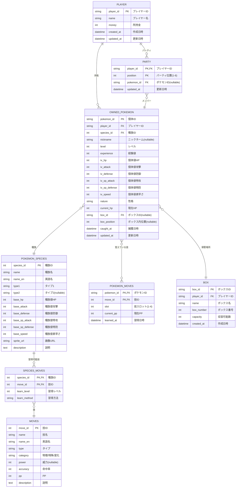
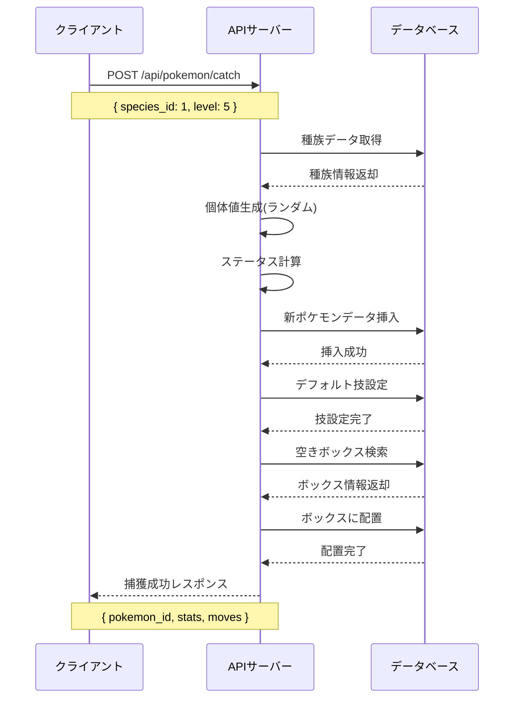
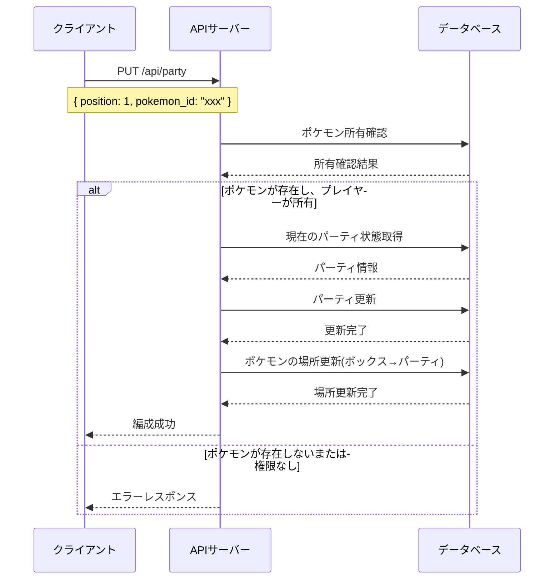

# ポケモン管理システム設計書

## 概要

ポケモンライクゲームにおけるポケモンの捕獲、育成、パーティ編成を管理するシステムの設計書です。
初学者向けのプロジェクトとして、学習効果を重視したシンプルで理解しやすい設計を採用します。

## システム要件

### 機能要件

1. **ポケモンデータ管理**
   - ポケモンの基本情報（種族、ステータス、レベル等）の管理
   - 個体値とレベルによる実際のステータス計算
   - 覚えている技の管理（最大4技）

2. **パーティ編成**
   - 手持ちポケモンの管理（最大6体）
   - パーティメンバーの並び替え
   - ポケモンの入れ替え

3. **ポケモンボックス**
   - 大量のポケモンの保管システム
   - ページネーション付きの閲覧機能
   - ボックスとパーティ間の移動

4. **レベルアップシステム**
   - 経験値による自動レベルアップ
   - レベルアップ時のステータス上昇
   - レベルアップ時の技習得

### 非機能要件

1. **パフォーマンス**
   - ポケモンリストの高速表示
   - 大量データの効率的な管理

2. **ユーザビリティ**
   - 直感的なUI/UX
   - ドラッグ&ドロップによる操作

3. **拡張性**
   - 新しいポケモン種族の追加容易性
   - 新機能の追加を考慮した設計

## データベース設計

### ER図



### テーブル設計の詳細

#### 1. PLAYER（プレイヤー）
プレイヤーの基本情報を管理。

#### 2. POKEMON_SPECIES（ポケモン種族）
ポケモンの種族データ（ピカチュウ、フシギダネ等）を管理。

#### 3. OWNED_POKEMON（所有ポケモン）
プレイヤーが所有する個々のポケモンの情報を管理。
- 個体値（IV）による個体差
- レベルと経験値
- 現在のHP状態

#### 4. MOVES（技）
ゲーム内の全技データを管理。

#### 5. POKEMON_MOVES（ポケモンの覚えている技）
各ポケモンが覚えている技（最大4つ）を管理。

#### 6. SPECIES_MOVES（種族習得技）
各種族がレベルアップで習得可能な技を管理。

#### 7. BOX（ボックス）
ポケモンの保管場所を管理。

#### 8. PARTY（パーティ）
手持ちポケモン（最大6体）を管理。

## API設計

### RESTful API エンドポイント

#### ポケモン管理

```
GET    /api/pokemon/owned           # 所有ポケモン一覧取得
POST   /api/pokemon/catch           # ポケモン捕獲
GET    /api/pokemon/owned/{id}      # 特定ポケモン詳細取得
PUT    /api/pokemon/owned/{id}      # ポケモン情報更新
DELETE /api/pokemon/owned/{id}      # ポケモン削除

GET    /api/pokemon/species         # 種族データ一覧
GET    /api/pokemon/species/{id}    # 特定種族データ取得
```

#### パーティ管理

```
GET    /api/party                   # パーティ取得
PUT    /api/party                   # パーティ編成更新
POST   /api/party/add               # パーティにポケモン追加
DELETE /api/party/{position}        # パーティからポケモン削除
PUT    /api/party/reorder           # パーティ順序変更
```

#### ボックス管理

```
GET    /api/boxes                   # ボックス一覧取得
GET    /api/boxes/{id}/pokemon      # ボックス内ポケモン取得
POST   /api/boxes/{id}/store        # ボックスにポケモン保管
PUT    /api/boxes/move              # ボックス間移動
```

#### レベルアップ・技習得

```
POST   /api/pokemon/{id}/gain-exp   # 経験値獲得
GET    /api/pokemon/{id}/learnable-moves  # 習得可能技取得
POST   /api/pokemon/{id}/learn-move # 技習得
DELETE /api/pokemon/{id}/forget-move # 技忘れ
```

### APIシーケンス図

#### ポケモン捕獲フロー



#### パーティ編成フロー



## 実装フェーズ

### Phase 1: データベーススキーマ作成
1. マイグレーションファイル作成
2. 基本テーブル定義
3. インデックス設定
4. 制約設定

### Phase 2: 基本CRUD API実装
1. ポケモン種族データAPI
2. 所有ポケモンCRUD
3. パーティ管理API
4. ボックス管理API

### Phase 3: 高度な機能実装
1. レベルアップシステム
2. 技習得システム
3. ステータス計算エンジン
4. 経験値計算

### Phase 4: フロントエンド統合
1. ポケモン一覧画面
2. パーティ編成画面
3. ボックス管理画面
4. ポケモン詳細画面

## 学習ポイント

### 初学者向け学習要素

1. **データベース設計**
   - 正規化の概念
   - リレーションシップの設計
   - インデックスの重要性

2. **REST API設計**
   - RESTful設計原則
   - HTTP ステータスコードの適切な使用
   - APIドキュメンテーション

3. **TypeScript活用**
   - 型安全なAPI開発
   - インターフェース設計
   - ジェネリクスの活用

4. **複雑なビジネスロジック**
   - ステータス計算アルゴリズム
   - レベルアップ処理
   - データ整合性の保証

5. **パフォーマンス最適化**
   - クエリ最適化
   - ページネーション
   - キャッシュ戦略

## 次のステップ

このドキュメントの承認後、以下の順序で実装を進めます：

1. データベースマイグレーション作成
2. 型定義ファイル作成
3. 基本CRUD操作の実装
4. テストの実装
5. API統合テスト

各実装ステップでは、TDD（テスト駆動開発）を採用し、
初学者が理解しやすいよう詳細なコメントとドキュメントを併記します。